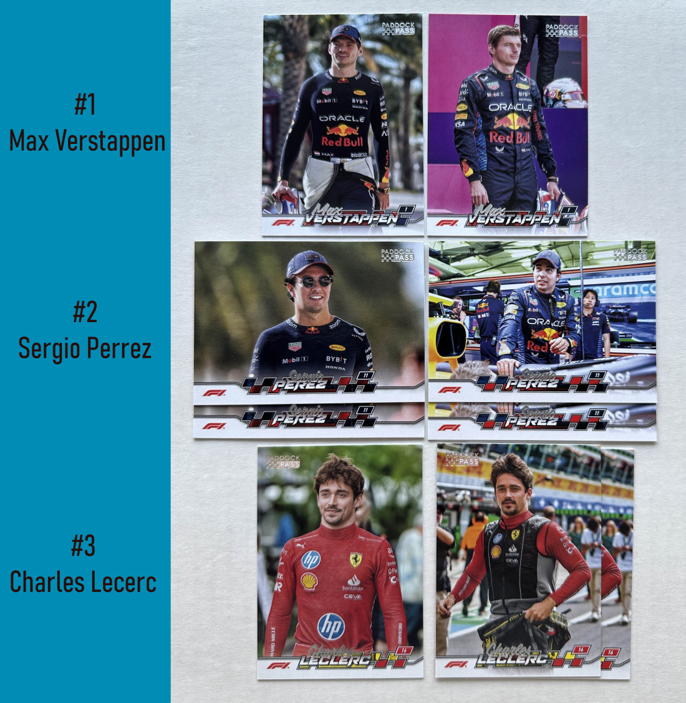
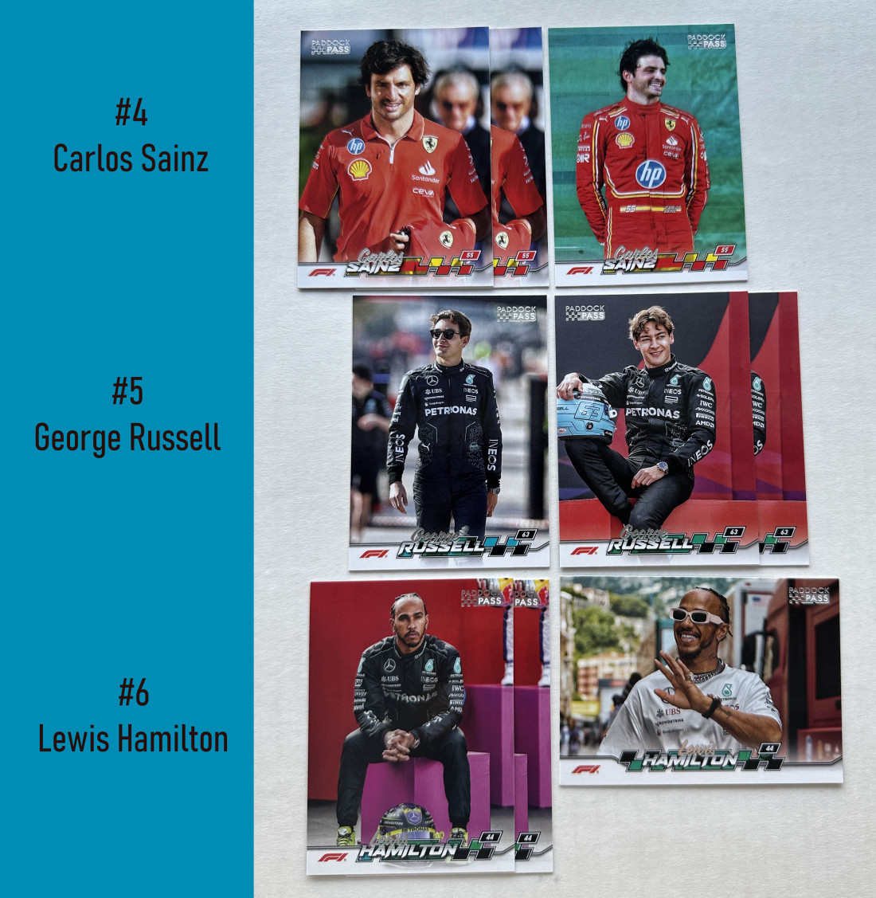
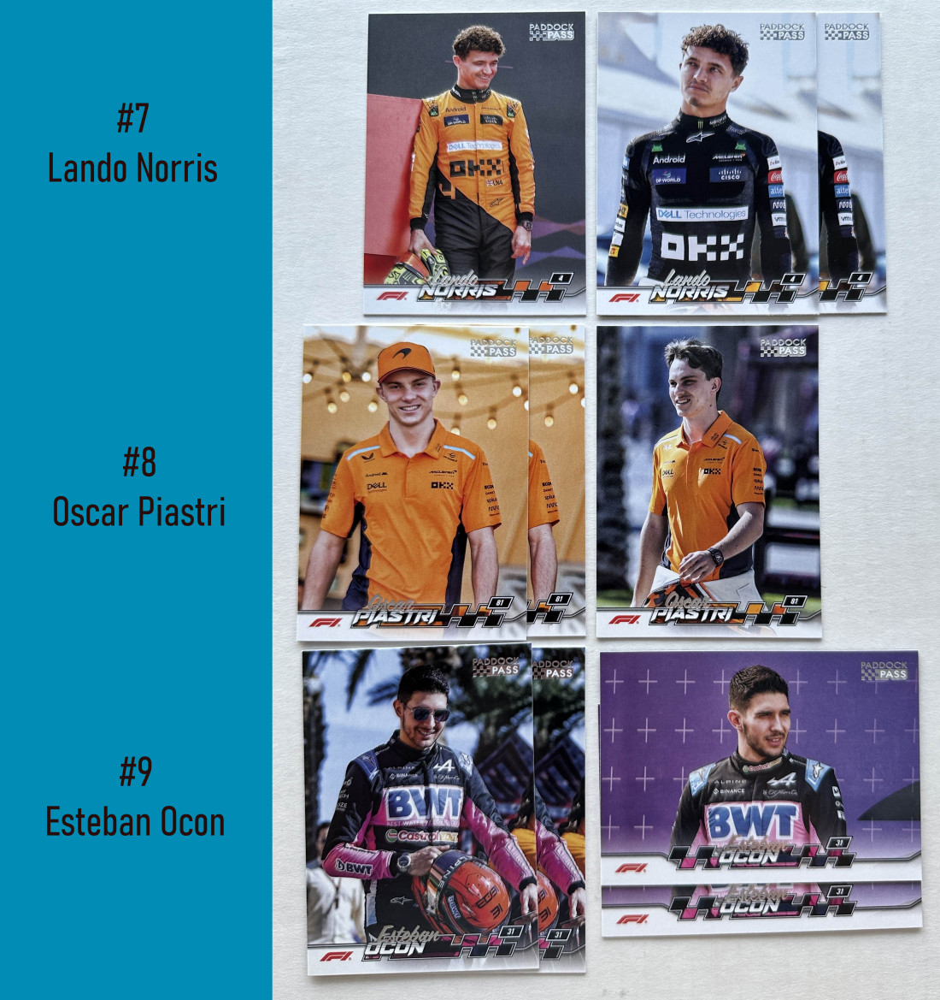
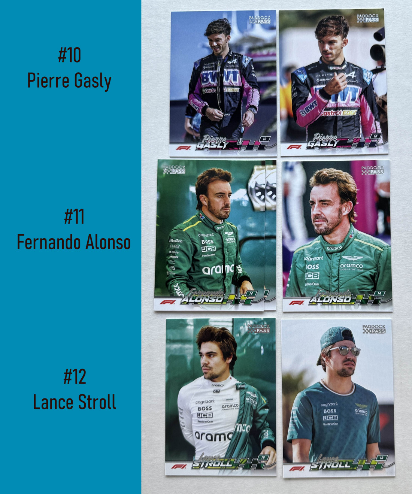
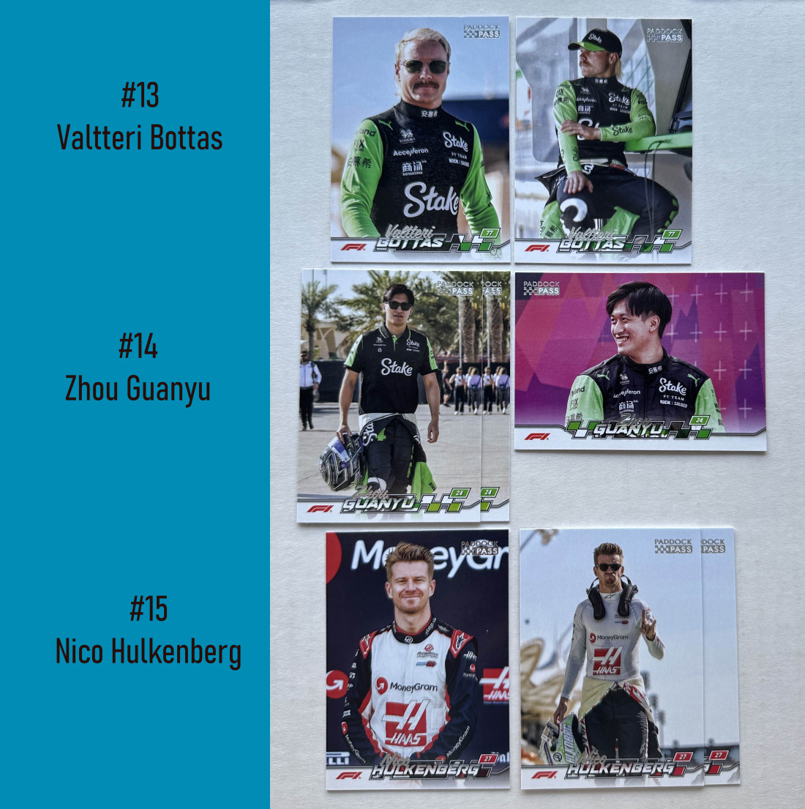
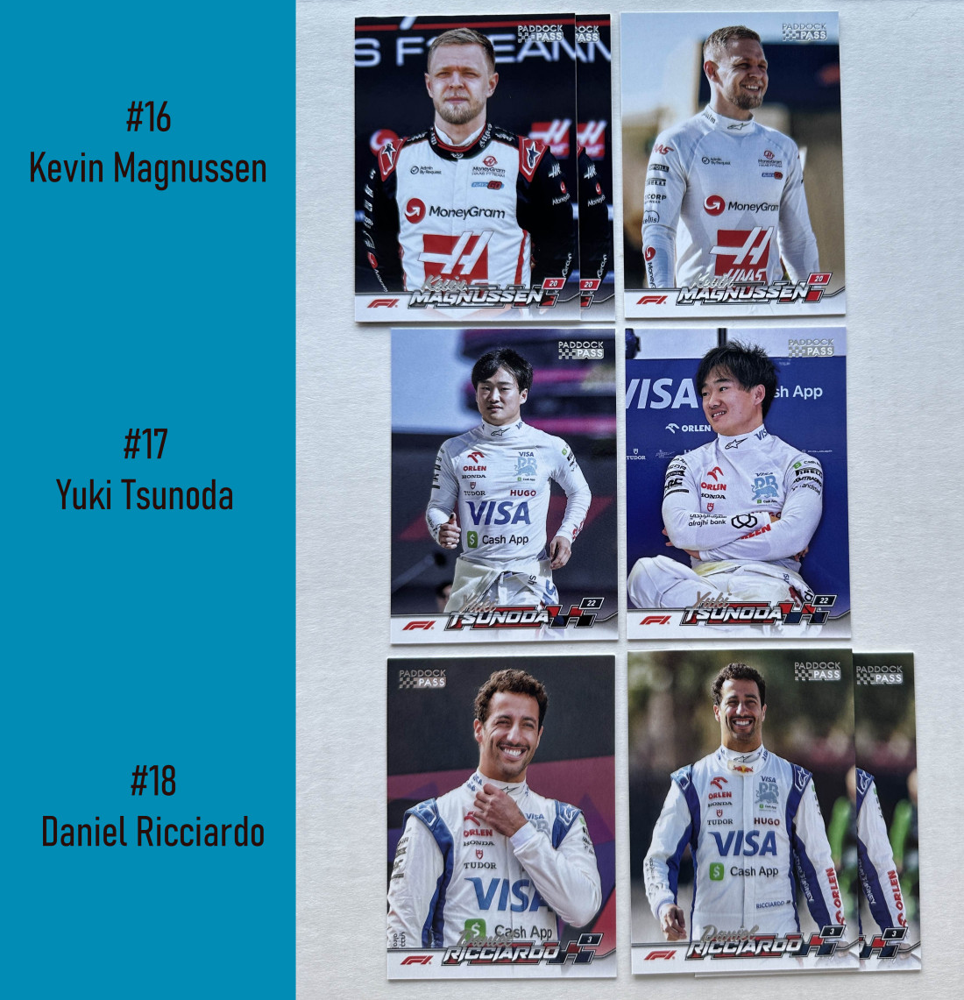
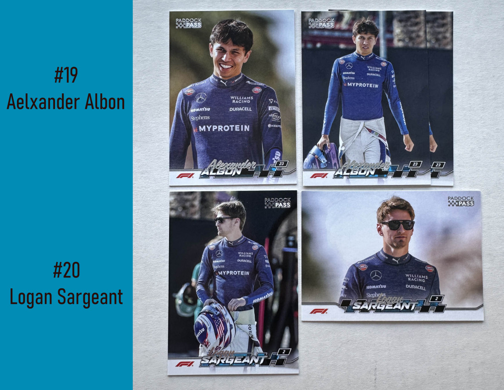

# 2024 Topps Paddock Pass Formula 1

80 cards

## Image Variations

It's not really clear which image is the variation and which is base, so we'll just call the images on the left the base and the images on the right the variations.

## Base Set

### Parallels
| Parallel | Numbering | Odds |
| --- | --- | --- |
| Red Foil |  | 1:1 hobby, 1:1 value, 1:1 fat pack |
| Black Foil |  | 1:8 hobby, 1:8 value, 1:8 fat pack |
| Black and White Foil |  | 1:48 hobby |
| Sepia |  | 1:8 value, 1:8 fat pack |
| Purple Foil | /75 | 1:47 hobby, 1:352 value, 1:151 fat pack |
| Blue Foil | /50 | 1:70 hobby, 1:527 value, 1:226 fat pack |
| Rainbow Foilboard | /25 | 1:140 hobby, 1:1,054 value, 1:452 fat pack |
| First Day Issue | /10 | 1:350 hobby, 1:2,623 value, 1:1,130 fat pack |
| Members Only |  | 1:256 hobby |
| Photographer's Proof |  | 1:512 hobby, 1:722 value, 1:433 fat pack |
| Gold Rainbow Foil | 1/1 | 1:3,479 hobby, 1:28,853 value, 1:10,167 fat pack |

### Cards
| Card Number/ID | Subset | Subject | Base Set | Red Foil | Black Foil | Black and White Foil | Sepia | Purple Foil | Blue Foil | Rainbow Foilboard | First Day Issue | Members Only | Photographer's Proof | Gold Rainbow Foil |
| :---: | --- | --- | :---: | :---: | :---: | :---: | :---: | :---: | :---: | :---: | :---: | :---: | :---: | :---: |
| 1 | F1 | Max Verstappen | [x] | [ ] | [ ] | [ ] | [ ] | [ ] | [ ] | [ ] | [ ] | [ ] | [ ] | [ ] |
| 2 | F1 | Sergio Perez | [x] | [ ] | [x] | [ ] | [ ] | [ ] | [ ] | [ ] | [ ] | [ ] | [ ] | [ ] |
| 3 | F1 | Charles Leclerc | [x] | [ ] | [ ] | [ ] | [ ] | [ ] | [ ] | [ ] | [ ] | [ ] | [ ] | [ ] |
| 4 | F1 | Carlos Sainz | [x] | [ ] | [ ] | [ ] | [ ] | [ ] | [ ] | [ ] | [ ] | [ ] | [ ] | [ ] |
| 5 | F1 | George Russell | [x] | [ ] | [ ] | [ ] | [ ] | [ ] | [ ] | [ ] | [ ] | [ ] | [ ] | [ ] |
| 6 | F1 | Lewis Hamilton | [ ] | [ ] | [ ] | [ ] | [ ] | [ ] | [ ] | [ ] | [ ] | [ ] | [ ] | [ ] |
| 7 | F1 | Lando Norris | [x] | [ ] | [ ] | [ ] | [ ] | [ ] | [ ] | [ ] | [ ] | [ ] | [ ] | [ ] |
| 8 | F1 | Oscar Piastri | [x] | [ ] | [ ] | [ ] | [ ] | [ ] | [ ] | [ ] | [ ] | [ ] | [ ] | [ ] |
| 9 | F1 | Esteban Ocon | [x] | [ ] | [x] | [ ] | [ ] | [ ] | [ ] | [ ] | [ ] | [ ] | [ ] | [ ] |
| 10 | F1 | Pierre Gasly | [x] | [ ] | [ ] | [ ] | [ ] | [ ] | [ ] | [ ] | [ ] | [ ] | [ ] | [ ] |
| 11 | F1 | Fernando Alonso | [x] | [ ] | [ ] | [ ] | [ ] | [ ] | [ ] | [ ] | [ ] | [ ] | [ ] | [ ] |
| 12 | F1 | Lance Stroll | [x] | [ ] | [ ] | [ ] | [ ] | [ ] | [ ] | [ ] | [ ] | [ ] | [ ] | [ ] |
| 13 | F1 | Valtteri Bottas | [x] | [ ] | [ ] | [ ] | [ ] | [ ] | [ ] | [ ] | [ ] | [ ] | [ ] | [ ] |
| 14 | F1 | Zhou Guanyu | [x] | [ ] | [ ] | [ ] | [ ] | [ ] | [ ] | [ ] | [ ] | [ ] | [ ] | [ ] |
| 15 | F1 | Nico Hulkenberg | [x] | [ ] | [x] | [ ] | [ ] | [ ] | [ ] | [ ] | [ ] | [ ] | [ ] | [ ] |
| 16 | F1 | Kevin Magnussen | [x] | [ ] | [ ] | [ ] | [ ] | [ ] | [ ] | [ ] | [ ] | [ ] | [ ] | [ ] |
| 17 | F1 | Yuki Tsunoda | [x] | [ ] | [ ] | [ ] | [ ] | [ ] | [ ] | [ ] | [ ] | [ ] | [ ] | [ ] |
| 18 | F1 | Daniel Ricciardo | [x] | [ ] | [ ] | [ ] | [ ] | [ ] | [ ] | [ ] | [ ] | [ ] | [ ] | [ ] |
| 19 | F1 | Alexander Albon | [x] | [ ] | [ ] | [ ] | [ ] | [ ] | [ ] | [ ] | [ ] | [ ] | [ ] | [ ] |
| 20 | F1 | Logan Sargeant | [x] | [ ] | [ ] | [ ] | [ ] | [ ] | [ ] | [ ] | [ ] | [ ] | [ ] | [ ] |
| 21 | F1 | Stoffel Vandoorne | [x] | [ ] | [ ] | [ ] | [ ] | [ ] | [ ] | [ ] | [ ] | [ ] | [ ] | [ ] |
| 22 | F1 | Antonio Giovinazzi | [x] | [ ] | [ ] | [ ] | [ ] | [ ] | [ ] | [ ] | [ ] | [ ] | [ ] | [ ] |
| 23 | F1 | Robert Shwartzman | [x] | [ ] | [ ] | [ ] | [ ] | [ ] | [ ] | [ ] | [ ] | [ ] | [ ] | [ ] |
| 24 | F1 | Felipe Drugovich | [x] | [ ] | [ ] | [ ] | [ ] | [ ] | [ ] | [ ] | [ ] | [ ] | [ ] | [ ] |
| 25 | F1 | Mick Schumacher | [x] | [ ] | [ ] | [ ] | [ ] | [ ] | [ ] | [ ] | [ ] | [ ] | [ ] | [ ] |
| 26 | F1 | Liam Lawson | [x] | [ ] | [ ] | [ ] | [ ] | [ ] | [ ] | [ ] | [ ] | [ ] | [ ] | [ ] |
| 27 | F1 | Jack Doohan | [x] | [ ] | [ ] | [ ] | [ ] | [ ] | [ ] | [ ] | [ ] | [ ] | [ ] | [ ] |
| 28 | F1 | Théo Pourchaire | [x] | [ ] | [ ] | [ ] | [ ] | [ ] | [ ] | [ ] | [ ] | [ ] | [ ] | [ ] |
| 29 | F1 | Pato O'Ward | [x] | [ ] | [x] | [ ] | [ ] | [ ] | [ ] | [ ] | [ ] | [ ] | [ ] | [ ] |
| 30 | F1 | Pietro Fittipaldi | [x] | [ ] | [ ] | [ ] | [ ] | [ ] | [ ] | [ ] | [ ] | [ ] | [ ] | [ ] |
| 31 | F1 Car | Max Verstappen | [x] | [ ] | [ ] | [ ] | [ ] | [ ] | [ ] | [ ] | [ ] | [ ] | [ ] | [ ] |
| 32 | F1 Car | Sergio Perez | [x] | [ ] | [ ] | [ ] | [ ] | [ ] | [ ] | [ ] | [ ] | [ ] | [ ] | [ ] |
| 33 | F1 Car | Charles Leclerc | [x] | [ ] | [ ] | [ ] | [ ] | [ ] | [ ] | [ ] | [ ] | [ ] | [ ] | [ ] |
| 34 | F1 Car | Carlos Sainz | [x] | [ ] | [ ] | [ ] | [ ] | [ ] | [ ] | [ ] | [ ] | [ ] | [ ] | [ ] |
| 35 | F1 Car | George Russell | [x] | [ ] | [ ] | [x] | [ ] | [ ] | [ ] | [ ] | [ ] | [ ] | [ ] | [ ] |
| 36 | F1 Car | Lewis Hamilton | [x] | [ ] | [ ] | [ ] | [ ] | [ ] | [ ] | [ ] | [ ] | [ ] | [ ] | [ ] |
| 37 | F1 Car | Lando Norris | [x] | [ ] | [ ] | [ ] | [ ] | [ ] | [ ] | [ ] | [ ] | [ ] | [ ] | [ ] |
| 38 | F1 Car | Oscar Piastri | [x] | [ ] | [ ] | [ ] | [ ] | [ ] | [ ] | [ ] | [ ] | [ ] | [ ] | [ ] |
| 39 | F1 Car | Esteban Ocon | [x] | [ ] | [ ] | [ ] | [ ] | [ ] | [ ] | [ ] | [ ] | [ ] | [ ] | [ ] |
| 40 | F1 Car | Pierre Gasly | [x] | [ ] | [ ] | [ ] | [ ] | [ ] | [ ] | [ ] | [ ] | [ ] | [ ] | [ ] |
| 41 | F1 Car | Fernando Alonso | [x] | [ ] | [ ] | [ ] | [ ] | [ ] | [ ] | [ ] | [ ] | [ ] | [ ] | [ ] |
| 42 | F1 Car | Lance Stroll | [x] | [ ] | [ ] | [ ] | [ ] | [ ] | [ ] | [ ] | [ ] | [ ] | [ ] | [ ] |
| 43 | F1 Car | Valtteri Bottas | [x] | [ ] | [ ] | [ ] | [ ] | [ ] | [ ] | [ ] | [ ] | [ ] | [ ] | [ ] |
| 44 | F1 Car | Zhou Guanyu | [x] | [ ] | [ ] | [ ] | [ ] | [ ] | [ ] | [ ] | [ ] | [ ] | [ ] | [ ] |
| 45 | F1 Car | Nico Hulkenberg | [x] | [ ] | [ ] | [ ] | [ ] | [ ] | [ ] | [ ] | [ ] | [ ] | [ ] | [ ] |
| 46 | F1 Car | Kevin Magnussen | [x] | [ ] | [ ] | [ ] | [ ] | [ ] | [ ] | [ ] | [ ] | [ ] | [ ] | [ ] |
| 47 | F1 Car | Yuki Tsunoda | [x] | [ ] | [ ] | [ ] | [ ] | [ ] | [ ] | [ ] | [ ] | [ ] | [ ] | [ ] |
| 48 | F1 Car | Daniel Ricciardo | [x] | [ ] | [ ] | [ ] | [ ] | [ ] | [ ] | [ ] | [ ] | [ ] | [ ] | [ ] |
| 49 | F1 Car | Alexander Albon | [x] | [ ] | [x] | [ ] | [ ] | [ ] | [ ] | [ ] | [ ] | [ ] | [ ] | [ ] |
| 50 | F1 Car | Logan Sargeant | [x] | [ ] | [ ] | [ ] | [ ] | [ ] | [ ] | [ ] | [ ] | [ ] | [ ] | [ ] |
| 51 | F1 Closeups | Max Verstappen | [x] | [ ] | [ ] | [ ] | [ ] | [ ] | [ ] | [ ] | [ ] | [ ] | [ ] | [ ] |
| 52 | F1 Closeups | Sergio Perez | [x] | [ ] | [ ] | [ ] | [ ] | [ ] | [ ] | [ ] | [ ] | [ ] | [ ] | [ ] |
| 53 | F1 Closeups | Charles Leclerc | [ ] | [ ] | [ ] | [ ] | [ ] | [ ] | [ ] | [ ] | [ ] | [ ] | [ ] | [ ] |
| 54 | F1 Closeups | Carlos Sainz | [x] | [ ] | [ ] | [ ] | [ ] | [ ] | [ ] | [ ] | [ ] | [ ] | [ ] | [ ] |
| 55 | F1 Closeups | George Russell | [x] | [ ] | [ ] | [ ] | [ ] | [ ] | [ ] | [ ] | [ ] | [ ] | [ ] | [ ] |
| 56 | F1 Closeups | Lewis Hamilton | [x] | [ ] | [ ] | [ ] | [ ] | [ ] | [ ] | [ ] | [ ] | [ ] | [ ] | [ ] |
| 57 | F1 Closeups | Lando Norris | [x] | [ ] | [ ] | [ ] | [ ] | [ ] | [ ] | [ ] | [ ] | [ ] | [ ] | [ ] |
| 58 | F1 Closeups | Oscar Piastri | [x] | [ ] | [ ] | [ ] | [ ] | [ ] | [ ] | [ ] | [ ] | [ ] | [ ] | [ ] |
| 59 | F1 Closeups | Esteban Ocon | [x] | [ ] | [ ] | [ ] | [ ] | [ ] | [ ] | [ ] | [ ] | [ ] | [ ] | [ ] |
| 60 | F1 Closeups | Pierre Gasly | [x] | [ ] | [ ] | [ ] | [ ] | [ ] | [ ] | [ ] | [ ] | [ ] | [ ] | [ ] |
| 61 | F1 Closeups | Fernando Alonso | [x] | [ ] | [ ] | [ ] | [ ] | [ ] | [ ] | [ ] | [ ] | [ ] | [ ] | [ ] |
| 62 | F1 Closeups | Lance Stroll | [x] | [ ] | [ ] | [ ] | [ ] | [ ] | [ ] | [ ] | [ ] | [ ] | [ ] | [ ] |
| 63 | F1 Closeups | Valtteri Bottas | [x] | [ ] | [x] | [ ] | [ ] | [ ] | [ ] | [ ] | [ ] | [ ] | [ ] | [ ] |
| 64 | F1 Closeups | Zhou Guanyu | [x] | [ ] | [ ] | [ ] | [ ] | [ ] | [ ] | [ ] | [ ] | [ ] | [ ] | [ ] |
| 65 | F1 Closeups | Nico Hulkenberg | [x] | [ ] | [ ] | [ ] | [ ] | [ ] | [ ] | [ ] | [ ] | [ ] | [ ] | [ ] |
| 66 | F1 Closeups | Kevin Magnussen | [x] | [ ] | [ ] | [ ] | [ ] | [ ] | [ ] | [ ] | [ ] | [ ] | [ ] | [ ] |
| 67 | F1 Closeups | Yuki Tsunoda | [x] | [ ] | [ ] | [ ] | [ ] | [ ] | [ ] | [ ] | [ ] | [ ] | [ ] | [ ] |
| 68 | F1 Closeups | Daniel Ricciardo | [x] | [ ] | [ ] | [ ] | [ ] | [ ] | [ ] | [ ] | [ ] | [ ] | [ ] | [ ] |
| 69 | F1 Closeups | Alexander Albon | [x] | [ ] | [x] | [ ] | [ ] | [ ] | [ ] | [ ] | [ ] | [ ] | [ ] | [ ] |
| 70 | F1 Closeups | Logan Sargeant | [x] | [ ] | [ ] | [ ] | [ ] | [ ] | [ ] | [ ] | [ ] | [ ] | [ ] | [ ] |
| 71 | F1 Team Principals | Toto Wolff | [x] | [ ] | [ ] | [ ] | [ ] | [ ] | [ ] | [ ] | [ ] | [ ] | [ ] | [ ] |
| 72 | F1 Team Principals | Christian Horner | [x] | [ ] | [ ] | [ ] | [ ] | [ ] | [ ] | [ ] | [ ] | [ ] | [ ] | [ ] |
| 73 | F1 Team Principals | Mike Krack | [x] | [ ] | [ ] | [ ] | [ ] | [ ] | [ ] | [ ] | [ ] | [ ] | [ ] | [ ] |
| 74 | F1 Team Principals | Bruno Famin | [x] | [ ] | [x] | [ ] | [ ] | [ ] | [ ] | [ ] | [ ] | [ ] | [ ] | [ ] |
| 75 | F1 Team Principals | Frédéric Vasseur | [x] | [ ] | [ ] | [ ] | [ ] | [ ] | [ ] | [ ] | [ ] | [ ] | [ ] | [ ] |
| 76 | F1 Team Principals | Andrea Stella | [x] | [ ] | [ ] | [ ] | [ ] | [ ] | [ ] | [ ] | [ ] | [ ] | [ ] | [ ] |
| 77 | F1 Team Principals | Laurent Mekies | [x] | [ ] | [ ] | [ ] | [ ] | [ ] | [ ] | [ ] | [ ] | [ ] | [ ] | [ ] |
| 78 | F1 Team Principals | James Vowles | [x] | [ ] | [ ] | [ ] | [ ] | [ ] | [ ] | [ ] | [ ] | [ ] | [ ] | [ ] |
| 79 | F1 Team Principals | Alessandro Alunni Bravi | [x] | [ ] | [ ] | [ ] | [ ] | [ ] | [ ] | [ ] | [ ] | [ ] | [ ] | [ ] |
| 80 | F1 Team Principals | Ayao Komatsu | [x] | [ ] | [ ] | [ ] | [ ] | [ ] | [ ] | [ ] | [ ] | [ ] | [ ] | [ ] |

## F1 Photo Variations

20 cards

### Cards
| Card Number/ID | Subject | F1 Photo Variations | Red Foil | Black Foil | Black and White Foil | Sepia | Purple Foil | Blue Foil | Rainbow Foilboard | First Day Issue | Members Only | Photographer's Proof | Gold Rainbow Foil |
| :---: | --- | :---: | :---: | :---: | :---: | :---: | :---: | :---: | :---: | :---: | :---: | :---: | :---: |
| 1 | Max Verstappen | [x] | [ ] | [ ] | [ ] | [ ] | [ ] | [ ] | [ ] | [ ] | [ ] | [ ] | [ ] |
| 2 | Sergio Perez | [x] | [x] | [ ] | [ ] | [ ] | [ ] | [ ] | [ ] | [ ] | [ ] | [ ] | [ ] |
| 3 | Charles Leclerc | [x] | [ ] | [ ] | [ ] | [ ] | [ ] | [ ] | [ ] | [ ] | [ ] | [ ] | [ ] |
| 4 | Carlos Sainz | [x] | [ ] | [ ] | [ ] | [ ] | [ ] | [ ] | [ ] | [ ] | [ ] | [ ] | [ ] |
| 5 | George Russell | [x] | [ ] | [ ] | [ ] | [ ] | [ ] | [ ] | [ ] | [ ] | [ ] | [ ] | [ ] |
| 6 | Lewis Hamilton | [x] | [ ] | [ ] | [ ] | [ ] | [ ] | [ ] | [ ] | [ ] | [ ] | [ ] | [ ] |
| 7 | Lando Norris | [x] | [ ] | [ ] | [ ] | [ ] | [ ] | [ ] | [ ] | [ ] | [ ] | [ ] | [ ] |
| 8 | Oscar Piastri | [x] | [ ] | [ ] | [ ] | [ ] | [ ] | [ ] | [ ] | [ ] | [ ] | [ ] | [ ] |
| 9 | Esteban Ocon | [x] | [ ] | [ ] | [ ] | [ ] | [ ] | [ ] | [ ] | [ ] | [ ] | [ ] | [ ] |
| 10 | Pierre Gasly | [x] | [ ] | [ ] | [ ] | [ ] | [ ] | [ ] | [ ] | [ ] | [ ] | [ ] | [ ] |
| 11 | Fernando Alonso | [x] | [ ] | [ ] | [ ] | [ ] | [ ] | [ ] | [ ] | [ ] | [ ] | [ ] | [ ] |
| 12 | Lance Stroll | [x] | [ ] | [ ] | [ ] | [ ] | [ ] | [ ] | [ ] | [ ] | [ ] | [ ] | [ ] |
| 13 | Valtteri Bottas | [x] | [ ] | [ ] | [ ] | [ ] | [ ] | [ ] | [ ] | [ ] | [ ] | [ ] | [ ] |
| 14 | Zhou Guanyu | [x] | [ ] | [ ] | [ ] | [ ] | [ ] | [ ] | [ ] | [ ] | [ ] | [ ] | [ ] |
| 15 | Nico Hulkenberg | [x] | [ ] | [ ] | [ ] | [ ] | [ ] | [ ] | [ ] | [ ] | [ ] | [ ] | [ ] |
| 16 | Kevin Magnussen | [x] | [ ] | [ ] | [ ] | [ ] | [ ] | [ ] | [ ] | [ ] | [ ] | [ ] | [ ] |
| 17 | Yuki Tsunoda | [x] | [ ] | [ ] | [ ] | [ ] | [ ] | [ ] | [ ] | [ ] | [ ] | [x] | [ ] |
| 18 | Daniel Ricciardo | [x] | [ ] | [x] | [ ] | [ ] | [ ] | [ ] | [ ] | [ ] | [ ] | [ ] | [ ] |
| 19 | Alexander Albon | [x] | [ ] | [ ] | [ ] | [ ] | [ ] | [ ] | [ ] | [ ] | [ ] | [ ] | [ ] |
| 20 | Logan Sargeant | [x] | [ ] | [ ] | [x] | [ ] | [ ] | [ ] | [ ] | [ ] | [ ] | [ ] | [ ] |

## Base Chrome

80 cards

1:1 hobby, 1:2 value, 1:1 fat packs.

### Parallels
| Parallel | Numbering | Odds |
| --- | --- | --- |
| Refractors |  | 1:4 hobby |
| Blue Refractors |  | 1:1 fat pack |
| X-Fractors |  | 1:2 value |
| Green Refractors | /275 | 1:10 hobby |
| Orange Refractors | /99 | 1;26 hobby |
| Purple Refractors | /75 | 1:34 hobby |
| Pearl White Refractors | /25 | 1:99 hobby |
| Gold Minted Refractors |  | 1:256 hobby |
| Superfractors | 1/1 | 1:2,439 hobby |

### Cards
| Card Number/ID | Subset | Subject | Base Chrome | Refractors | Blue Refractors | X-Fractors | Green Refractors | Orange Refractors | Purple Refractors | Pearl White Refractors | Gold Minted Refractors | Superfractors |
| :---: | --- | --- | :---: | :---: | :---: | :---: | :---: | :---: | :---: | :---: | :---: | :---: |
| 1 | F1 | Max Verstappen | [x] | [ ] | [ ] | [ ] | [ ] | [ ] | [ ] | [ ] | [ ] | [ ] |
| 2 | F1 | Sergio Perez | [ ] | [ ] | [ ] | [ ] | [ ] | [ ] | [ ] | [ ] | [ ] | [ ] |
| 3 | F1 | Charles Leclerc | [ ] | [ ] | [ ] | [ ] | [ ] | [ ] | [ ] | [ ] | [ ] | [ ] |
| 4 | F1 | Carlos Sainz | [x] | [ ] | [ ] | [ ] | [ ] | [ ] | [ ] | [ ] | [ ] | [ ] |
| 5 | F1 | George Russell | [x] | [ ] | [ ] | [ ] | [ ] | [ ] | [ ] | [ ] | [ ] | [ ] |
| 6 | F1 | Lewis Hamilton | [ ] | [ ] | [ ] | [ ] | [ ] | [ ] | [ ] | [ ] | [ ] | [ ] |
| 7 | F1 | Lando Norris | [x] | [ ] | [ ] | [ ] | [ ] | [ ] | [ ] | [ ] | [ ] | [ ] |
| 8 | F1 | Oscar Piastri | [ ] | [ ] | [ ] | [ ] | [ ] | [ ] | [ ] | [ ] | [ ] | [ ] |
| 9 | F1 | Esteban Ocon | [ ] | [ ] | [ ] | [ ] | [ ] | [ ] | [ ] | [ ] | [ ] | [ ] |
| 10 | F1 | Pierre Gasly | [ ] | [ ] | [ ] | [ ] | [ ] | [ ] | [ ] | [ ] | [ ] | [ ] |
| 11 | F1 | Fernando Alonso | [ ] | [ ] | [ ] | [ ] | [ ] | [ ] | [ ] | [ ] | [ ] | [ ] |
| 12 | F1 | Lance Stroll | [x] | [ ] | [ ] | [ ] | [ ] | [ ] | [ ] | [ ] | [ ] | [ ] |
| 13 | F1 | Valtteri Bottas | [x] | [ ] | [ ] | [ ] | [ ] | [ ] | [ ] | [ ] | [ ] | [ ] |
| 14 | F1 | Zhou Guanyu | [ ] | [x] | [ ] | [ ] | [ ] | [ ] | [ ] | [ ] | [ ] | [ ] |
| 15 | F1 | Nico Hulkenberg | [ ] | [ ] | [ ] | [ ] | [ ] | [ ] | [ ] | [ ] | [ ] | [ ] |
| 16 | F1 | Kevin Magnussen | [x] | [ ] | [ ] | [ ] | [ ] | [ ] | [ ] | [ ] | [ ] | [ ] |
| 17 | F1 | Yuki Tsunoda | [ ] | [ ] | [ ] | [ ] | [ ] | [ ] | [ ] | [ ] | [ ] | [ ] |
| 18 | F1 | Daniel Ricciardo | [ ] | [ ] | [ ] | [ ] | [ ] | [ ] | [ ] | [ ] | [ ] | [ ] |
| 19 | F1 | Alexander Albon | [x] | [ ] | [ ] | [ ] | [ ] | [ ] | [ ] | [ ] | [ ] | [ ] |
| 20 | F1 | Logan Sargeant | [x] | [ ] | [ ] | [ ] | [ ] | [ ] | [ ] | [ ] | [ ] | [ ] |
| 21 | F1 | Stoffel Vandoorne | [x] | [ ] | [ ] | [ ] | [ ] | [ ] | [ ] | [ ] | [ ] | [ ] |
| 22 | F1 | Antonio Giovinazzi | [ ] | [ ] | [ ] | [ ] | [ ] | [ ] | [ ] | [ ] | [ ] | [ ] |
| 23 | F1 | Robert Shwartzman | [ ] | [ ] | [ ] | [ ] | [ ] | [ ] | [ ] | [ ] | [ ] | [ ] |
| 24 | F1 | Felipe Drugovich | [ ] | [x] | [ ] | [ ] | [ ] | [ ] | [ ] | [ ] | [ ] | [ ] |
| 25 | F1 | Mick Schumacher | [ ] | [x] | [ ] | [ ] | [ ] | [ ] | [ ] | [ ] | [ ] | [ ] |
| 26 | F1 | Liam Lawson | [ ] | [ ] | [ ] | [ ] | [ ] | [ ] | [ ] | [ ] | [ ] | [ ] |
| 27 | F1 | Jack Doohan | [x] | [ ] | [ ] | [ ] | [ ] | [ ] | [ ] | [ ] | [ ] | [ ] |
| 28 | F1 | Théo Pourchaire | [x] | [ ] | [ ] | [ ] | [ ] | [ ] | [ ] | [ ] | [ ] | [ ] |
| 29 | F1 | Pato O'Ward | [x] | [ ] | [ ] | [ ] | [ ] | [ ] | [ ] | [ ] | [ ] | [ ] |
| 30 | F1 | Pietro Fittipaldi | [ ] | [ ] | [ ] | [ ] | [ ] | [ ] | [ ] | [ ] | [ ] | [ ] |
| 31 | F1 Car | Max Verstappen | [ ] | [ ] | [ ] | [ ] | [ ] | [ ] | [ ] | [ ] | [ ] | [ ] |
| 32 | F1 Car | Sergio Perez | [ ] | [x] | [ ] | [ ] | [ ] | [ ] | [ ] | [ ] | [ ] | [ ] |
| 33 | F1 Car | Charles Leclerc | [ ] | [ ] | [ ] | [ ] | [ ] | [ ] | [ ] | [ ] | [ ] | [ ] |
| 34 | F1 Car | Carlos Sainz | [x] | [ ] | [ ] | [ ] | [ ] | [ ] | [ ] | [ ] | [ ] | [ ] |
| 35 | F1 Car | George Russell | [ ] | [ ] | [ ] | [ ] | [ ] | [ ] | [ ] | [ ] | [ ] | [ ] |
| 36 | F1 Car | Lewis Hamilton | [ ] | [ ] | [ ] | [ ] | [ ] | [ ] | [ ] | [ ] | [ ] | [ ] |
| 37 | F1 Car | Lando Norris | [x] | [ ] | [ ] | [ ] | [ ] | [ ] | [ ] | [ ] | [ ] | [ ] |
| 38 | F1 Car | Oscar Piastri | [ ] | [ ] | [ ] | [ ] | [ ] | [ ] | [ ] | [ ] | [ ] | [ ] |
| 39 | F1 Car | Esteban Ocon | [x] | [ ] | [ ] | [ ] | [ ] | [ ] | [ ] | [ ] | [ ] | [ ] |
| 40 | F1 Car | Pierre Gasly | [x] | [x] | [ ] | [ ] | [ ] | [ ] | [ ] | [ ] | [ ] | [ ] |
| 41 | F1 Car | Fernando Alonso | [x] | [ ] | [ ] | [ ] | [ ] | [ ] | [ ] | [ ] | [ ] | [ ] |
| 42 | F1 Car | Lance Stroll | [x] | [ ] | [ ] | [ ] | [ ] | [ ] | [ ] | [ ] | [ ] | [ ] |
| 43 | F1 Car | Valtteri Bottas | [x] | [ ] | [ ] | [ ] | [ ] | [ ] | [ ] | [ ] | [ ] | [ ] |
| 44 | F1 Car | Zhou Guanyu | [x] | [ ] | [ ] | [ ] | [ ] | [ ] | [ ] | [ ] | [ ] | [ ] |
| 45 | F1 Car | Nico Hulkenberg | [ ] | [ ] | [ ] | [ ] | [ ] | [ ] | [ ] | [ ] | [ ] | [ ] |
| 46 | F1 Car | Kevin Magnussen | [ ] | [ ] | [ ] | [ ] | [ ] | [ ] | [ ] | [ ] | [ ] | [ ] |
| 47 | F1 Car | Yuki Tsunoda | [x] | [ ] | [ ] | [ ] | [ ] | [ ] | [ ] | [ ] | [ ] | [ ] |
| 48 | F1 Car | Daniel Ricciardo | [x] | [ ] | [ ] | [ ] | [ ] | [ ] | [ ] | [ ] | [ ] | [ ] |
| 49 | F1 Car | Alexander Albon | [x] | [ ] | [ ] | [ ] | [ ] | [ ] | [ ] | [ ] | [ ] | [ ] |
| 50 | F1 Car | Logan Sargeant | [ ] | [ ] | [ ] | [ ] | [ ] | [ ] | [ ] | [ ] | [ ] | [ ] |
| 51 | F1 Closeups | Max Verstappen | [ ] | [ ] | [ ] | [ ] | [ ] | [ ] | [ ] | [ ] | [ ] | [ ] |
| 52 | F1 Closeups | Sergio Perez | [ ] | [ ] | [ ] | [ ] | [ ] | [ ] | [ ] | [ ] | [ ] | [ ] |
| 53 | F1 Closeups | Charles Leclerc | [x] | [ ] | [ ] | [ ] | [ ] | [ ] | [ ] | [ ] | [ ] | [ ] |
| 54 | F1 Closeups | Carlos Sainz | [x] | [ ] | [ ] | [ ] | [ ] | [ ] | [ ] | [ ] | [ ] | [ ] |
| 55 | F1 Closeups | George Russell | [x] | [ ] | [ ] | [ ] | [ ] | [ ] | [ ] | [ ] | [ ] | [ ] |
| 56 | F1 Closeups | Lewis Hamilton | [x] | [ ] | [ ] | [ ] | [ ] | [ ] | [ ] | [ ] | [ ] | [ ] |
| 57 | F1 Closeups | Lando Norris | [x] | [ ] | [ ] | [ ] | [ ] | [ ] | [ ] | [ ] | [ ] | [ ] |
| 58 | F1 Closeups | Oscar Piastri | [ ] | [ ] | [ ] | [ ] | [ ] | [ ] | [ ] | [ ] | [ ] | [ ] |
| 59 | F1 Closeups | Esteban Ocon | [ ] | [ ] | [ ] | [ ] | [ ] | [ ] | [ ] | [ ] | [ ] | [ ] |
| 60 | F1 Closeups | Pierre Gasly | [x] | [ ] | [ ] | [ ] | [ ] | [ ] | [ ] | [ ] | [ ] | [ ] |
| 61 | F1 Closeups | Fernando Alonso | [ ] | [x] | [ ] | [ ] | [ ] | [ ] | [ ] | [ ] | [ ] | [ ] |
| 62 | F1 Closeups | Lance Stroll | [ ] | [ ] | [ ] | [ ] | [ ] | [ ] | [ ] | [ ] | [ ] | [ ] |
| 63 | F1 Closeups | Valtteri Bottas | [x] | [x] | [ ] | [ ] | [ ] | [ ] | [ ] | [ ] | [ ] | [ ] |
| 64 | F1 Closeups | Zhou Guanyu | [ ] | [ ] | [ ] | [ ] | [ ] | [ ] | [ ] | [ ] | [ ] | [ ] |
| 65 | F1 Closeups | Nico Hulkenberg | [x] | [ ] | [ ] | [ ] | [ ] | [ ] | [ ] | [ ] | [ ] | [ ] |
| 66 | F1 Closeups | Kevin Magnussen | [x] | [ ] | [ ] | [ ] | [ ] | [ ] | [ ] | [ ] | [ ] | [ ] |
| 67 | F1 Closeups | Yuki Tsunoda | [ ] | [ ] | [ ] | [ ] | [ ] | [ ] | [ ] | [ ] | [ ] | [ ] |
| 68 | F1 Closeups | Daniel Ricciardo | [ ] | [ ] | [ ] | [ ] | [ ] | [ ] | [ ] | [ ] | [ ] | [ ] |
| 69 | F1 Closeups | Alexander Albon | [x] | [ ] | [ ] | [ ] | [ ] | [ ] | [ ] | [ ] | [ ] | [ ] |
| 71 | F1 Team Principals | Toto Wolff | [ ] | [ ] | [ ] | [ ] | [ ] | [ ] | [ ] | [ ] | [ ] | [ ] |
| 72 | F1 Team Principals | Christian Horner | [ ] | [ ] | [ ] | [ ] | [ ] | [ ] | [ ] | [ ] | [ ] | [ ] |
| 73 | F1 Team Principals | Mike Krack | [x] | [ ] | [ ] | [ ] | [ ] | [ ] | [ ] | [ ] | [ ] | [ ] |
| 74 | F1 Team Principals | Bruno Famin | [ ] | [ ] | [ ] | [ ] | [ ] | [ ] | [ ] | [ ] | [ ] | [ ] |
| 75 | F1 Team Principals | Frédéric Vasseur | [ ] | [x] | [ ] | [ ] | [ ] | [ ] | [ ] | [ ] | [ ] | [ ] |
| 76 | F1 Team Principals | Andrea Stella | [ ] | [ ] | [ ] | [ ] | [ ] | [ ] | [ ] | [ ] | [ ] | [ ] |
| 77 | F1 Team Principals | Laurent Mekies | [x] | [ ] | [ ] | [ ] | [ ] | [ ] | [ ] | [ ] | [ ] | [ ] |
| 78 | F1 Team Principals | James Vowles | [x] | [ ] | [ ] | [ ] | [ ] | [ ] | [ ] | [ ] | [ ] | [ ] |
| 79 | F1 Team Principals | Alessandro Alunni Bravi | [ ] | [x] | [ ] | [ ] | [ ] | [ ] | [ ] | [ ] | [ ] | [ ] |
| 80 | F1 Team Principals | Ayao Komatsu | [ ] | [x] | [ ] | [ ] | [ ] | [ ] | [ ] | [ ] | [ ] | [ ] |

## F1 Photo Variations Chrome

20 cards

### Cards
| Card Number/ID | Subject | F1 Photo Variations Chrome | Refractors | Blue Refractors | X-Fractors | Green Refractors | Orange Refractors | Purple Refractors | Pearl White Refractors | Gold Minted Refractors | Superfractors |
| :---: | --- | :---: | :---: | :---: | :---: | :---: | :---: | :---: | :---: | :---: | :---: |
| 1 | Max Verstappen | [ ] | [ ] | [ ] | [ ] | [ ] | [ ] | [ ] | [ ] | [ ] | [ ] |
| 2 | Sergio Perez | [ ] | [x] | [ ] | [ ] | [ ] | [ ] | [ ] | [ ] | [ ] | [ ] |
| 3 | Charles Leclerc | [ ] | [ ] | [ ] | [ ] | [ ] | [ ] | [ ] | [ ] | [ ] | [ ] |
| 4 | Carlos Sainz | [ ] | [ ] | [ ] | [ ] | [ ] | [ ] | [ ] | [ ] | [ ] | [ ] |
| 5 | George Russell | [x] | [ ] | [ ] | [ ] | [ ] | [ ] | [ ] | [ ] | [ ] | [ ] |
| 6 | Lewis Hamilton | [x] | [ ] | [ ] | [ ] | [ ] | [ ] | [ ] | [ ] | [ ] | [ ] |
| 7 | Lando Norris | [ ] | [ ] | [ ] | [ ] | [ ] | [ ] | [ ] | [ ] | [ ] | [ ] |
| 8 | Oscar Piastri | [ ] | [ ] | [ ] | [ ] | [ ] | [ ] | [ ] | [ ] | [ ] | [ ] |
| 9 | Esteban Ocon | [ ] | [x] | [ ] | [ ] | [ ] | [ ] | [ ] | [ ] | [ ] | [ ] |
| 10 | Pierre Gasly | [ ] | [ ] | [ ] | [ ] | [ ] | [ ] | [ ] | [ ] | [ ] | [ ] |
| 11 | Fernando Alonso | [x] | [ ] | [ ] | [ ] | [ ] | [ ] | [ ] | [ ] | [ ] | [ ] |
| 12 | Lance Stroll | [ ] | [ ] | [ ] | [ ] | [ ] | [ ] | [ ] | [ ] | [ ] | [ ] |
| 13 | Valtteri Bottas | [x] | [ ] | [ ] | [ ] | [ ] | [ ] | [ ] | [ ] | [ ] | [ ] |
| 14 | Zhou Guanyu | [ ] | [ ] | [ ] | [ ] | [ ] | [ ] | [ ] | [ ] | [ ] | [ ] |
| 15 | Nico Hulkenberg | [ ] | [ ] | [ ] | [ ] | [ ] | [ ] | [ ] | [ ] | [ ] | [ ] |
| 16 | Kevin Magnussen | [ ] | [ ] | [ ] | [ ] | [ ] | [ ] | [ ] | [ ] | [ ] | [ ] |
| 17 | Yuki Tsunoda | [x] | [ ] | [ ] | [ ] | [ ] | [ ] | [ ] | [ ] | [ ] | [ ] |
| 18 | Daniel Ricciardo | [ ] | [x] | [ ] | [ ] | [ ] | [ ] | [ ] | [ ] | [ ] | [ ] |
| 19 | Alexander Albon | [x] | [ ] | [ ] | [ ] | [ ] | [ ] | [ ] | [ ] | [ ] | [ ] |
| 20 | Logan Sargeant | [x] | [ ] | [ ] | [ ] | [ ] | [ ] | [ ] | [ ] | [ ] | [ ] |

## Apex Autographs

20 cards (/20)

1:1,806 hobby, 1:9,618 value, 1:16,267 fat packs.

### Parallels
| Parallel | Numbering | Odds |
| --- | --- | --- |
| Rainbow | /5 | 1:39,424 hobby, 1:144,264 value |
| Green | /3 | 1:6,571 hobby, 1:36,066 value, 1:40,668 fat pack |
| Gold Rainbow | 1/1 | 1:18,196 hobby, 1:72,132 value, 1:81,335 fat pack |

### Cards
| Card Number/ID | Subject | Apex Autographs | Rainbow | Green | Gold Rainbow |
| :---: | --- | :---: | :---: | :---: | :---: |
| AP-ALB | Alexander Albon | [ ] | [ ] | [ ] | [ ] |
| AP-ALO | Fernando Alonso | [ ] | [ ] | [ ] | [ ] |
| AP-BOT | Valtteri Bottas | [ ] | [ ] | [ ] | [ ] |
| AP-GAS | Pierre Gasly | [ ] | [ ] | [ ] | [ ] |
| AP-HAM | Lewis Hamilton | [ ] | [ ] | [ ] | [ ] |
| AP-HUL | Nico Hulkenberg | [ ] | [ ] | [ ] | [ ] |
| AP-LEC | Charles Leclerc | [ ] | [ ] | [ ] | [ ] |
| AP-MAG | Kevin Magnussen | [ ] | [ ] | [ ] | [ ] |
| AP-NOR | Lando Norris | [ ] | [ ] | [ ] | [ ] |
| AP-OCO | Esteban Ocon | [ ] | [ ] | [ ] | [ ] |
| AP-PER | Sergio Perez | [ ] | [ ] | [ ] | [ ] |
| AP-PIA | Oscar Piastri | [ ] | [ ] | [ ] | [ ] |
| AP-RIC | Daniel Ricciardo | [ ] | [ ] | [ ] | [ ] |
| AP-RUS | George Russell | [ ] | [ ] | [ ] | [ ] |
| AP-SAI | Carlos Sainz | [ ] | [ ] | [ ] | [ ] |
| AP-SAR | Logan Sargeant | [ ] | [ ] | [ ] | [ ] |
| AP-STR | Lance Stroll | [ ] | [ ] | [ ] | [ ] |
| AP-TSU | Yuki Tsunoda | [ ] | [ ] | [ ] | [ ] |
| AP-VER | Max Verstappen | [ ] | [ ] | [ ] | [ ] |
| AP-ZHO | Zhou Guanyu | [ ] | [ ] | [ ] | [ ] |

## Beam Team Autographs

20 cards

1:4,010 hobby packs.

### Cards
| Card Number/ID | Subject | Beam Team Autographs |
| :---: | --- | :---: |
| BTA-AAL | Alexander Albon | [ ] |
| BTA-CLE | Charles Leclerc | [ ] |
| BTA-CSA | Carlos Sainz | [ ] |
| BTA-DRI | Daniel Ricciardo | [ ] |
| BTA-EOC | Esteban Ocon | [ ] |
| BTA-FAL | Fernando Alonso | [ ] |
| BTA-GRU | George Russell | [ ] |
| BTA-KMA | Kevin Magnussen | [ ] |
| BTA-LHA | Lewis Hamilton | [ ] |
| BTA-LNO | Lando Norris | [ ] |
| BTA-LSA | Logan Sargeant | [ ] |
| BTA-LST | Lance Stroll | [ ] |
| BTA-MVE | Max Verstappen | [ ] |
| BTA-NHU | Nico Hulkenberg | [ ] |
| BTA-OPI | Oscar Piastri | [ ] |
| BTA-PGA | Pierre Gasly | [ ] |
| BTA-SPE | Sergio Perez | [ ] |
| BTA-VBO | Valtteri Bottas | [ ] |
| BTA-YTS | Yuki Tsunoda | [ ] |
| BTA-ZGU | Zhou Guanyu | [ ] |

## Co-Signers Autographs

10 cards

1:6,958 hobby packs.

### Cards
| Card Number/ID | Subject | Co-Signers Autographs |
| :---: | --- | :---: |
| CSA-AS | Fernando Alonso / Lance Stroll | [ ] |
| CSA-BG | Valtteri Bottas / Zhou Guanyu | [ ] |
| CSA-GO | Esteban Ocon / Pierre Gasly | [ ] |
| CSA-HM | Nico Hulkenberg / Kevin Magnussen | [ ] |
| CSA-HR | Lewis Hamilton / George Russell | [ ] |
| CSA-LS | Charles Leclerc / Carlos Sainz | [ ] |
| CSA-NP | Oscar Piastri / Lando Norris | [ ] |
| CSA-RT | Daniel Ricciardo / Yuki Tsunoda | [ ] |
| CSA-SA | Alexander Albon / Logan Sargeant | [ ] |
| CSA-VP | Sergio Perez / Max Verstappen | [ ] |

## Lone Star Signatures

30 cards (/20)

1:880 hobby, 1:4,809 value, 1:10,167 fat packs.

### Parallels
| Parallel | Numbering | Odds |
| --- | --- | --- |
| Red | /15 | 1:7,631 hobby, 1:48,088 value, 1:81,335 fat pack |
| Black | /10 | 1:3,380 hobby, 1:18,033 value, 1:40,668 fat pack |
| Rainbow | /5 | 1:2,751 hobby, 1:14,427 value, 1:27,112 fat pack |
| Green | /3 | 1:10,752 hobby, 1:48,088 value, 1:81,335 fat pack |
| Gold Rainbow | 1/1 | 1:11,264 hobby, 1:72,132 value, 1:81.335 fat pack |

### Cards
| Card Number/ID | Subject | Lone Star Signatures | Red | Black | Rainbow | Green | Gold Rainbow |
| :---: | --- | :---: | :---: | :---: | :---: | :---: | :---: |
| LS-AKO | Ayao Komatsu | [ ] | [ ] | [ ] | [ ] | [ ] | [ ] |
| LS-ALB | Alexander Albon | [ ] | [ ] | [ ] | [ ] | [ ] | [ ] |
| LS-ALO | Fernando Alonso | [ ] | [ ] | [ ] | [ ] | [ ] | [ ] |
| LS-ALU | Alessandro Alunni Bravi | [ ] | [ ] | [ ] | [ ] | [ ] | [ ] |
| LS-BOT | Valtteri Bottas | [ ] | [ ] | [ ] | [ ] | [ ] | [ ] |
| LS-FAM | Bruno Famin | [ ] | [ ] | [ ] | [ ] | [ ] | [ ] |
| LS-GAS | Pierre Gasly | [ ] | [ ] | [ ] | [ ] | [ ] | [ ] |
| LS-HAM | Lewis Hamilton | [ ] | [ ] | [ ] | [ ] | [ ] | [ ] |
| LS-HOR | Christian Horner | [ ] | [ ] | [ ] | [ ] | [ ] | [ ] |
| LS-HUL | Nico Hulkenberg | [ ] | [ ] | [ ] | [ ] | [ ] | [ ] |
| LS-KRA | Mike Krack | [ ] | [ ] | [ ] | [ ] | [ ] | [ ] |
| LS-LEC | Charles Leclerc | [ ] | [ ] | [ ] | [ ] | [ ] | [ ] |
| LS-MAG | Kevin Magnussen | [ ] | [ ] | [ ] | [ ] | [ ] | [ ] |
| LS-MEK | Laurent Mekies | [ ] | [ ] | [ ] | [ ] | [ ] | [ ] |
| LS-NOR | Lando Norris | [ ] | [ ] | [ ] | [ ] | [ ] | [ ] |
| LS-OCO | Esteban Ocon | [ ] | [ ] | [ ] | [ ] | [ ] | [ ] |
| LS-PER | Sergio Perez | [ ] | [ ] | [ ] | [ ] | [ ] | [ ] |
| LS-PIA | Oscar Piastri | [ ] | [ ] | [ ] | [ ] | [ ] | [ ] |
| LS-RIC | Daniel Ricciardo | [ ] | [ ] | [ ] | [ ] | [ ] | [ ] |
| LS-RUS | George Russell | [ ] | [ ] | [ ] | [ ] | [ ] | [ ] |
| LS-SAI | Carlos Sainz | [ ] | [ ] | [ ] | [ ] | [ ] | [ ] |
| LS-SAR | Logan Sargeant | [ ] | [ ] | [ ] | [ ] | [ ] | [ ] |
| LS-STE | Andrea Stella | [ ] | [ ] | [ ] | [ ] | [ ] | [ ] |
| LS-STR | Lance Stroll | [ ] | [ ] | [ ] | [ ] | [ ] | [ ] |
| LS-TSU | Yuki Tsunoda | [ ] | [ ] | [ ] | [ ] | [ ] | [ ] |
| LS-VAS | Frédéric Vasseur | [ ] | [ ] | [ ] | [ ] | [ ] | [ ] |
| LS-VER | Max Verstappen | [ ] | [ ] | [ ] | [ ] | [ ] | [ ] |
| LS-VOW | James Vowles | [ ] | [ ] | [ ] | [ ] | [ ] | [ ] |
| LS-WOL | Toto Wolff | [ ] | [ ] | [ ] | [ ] | [ ] | [ ] |
| LS-ZHO | Zhou Guanyu | [ ] | [ ] | [ ] | [ ] | [ ] | [ ] |

## Paddock Pass Signatures

30 cards (/20)

1:572 hobby, 1:3,070 value, 1:5,810 fat packs.

### Parallels
| Parallel | Numbering | Odds |
| --- | --- | --- |
| Red | /15 | 1:1,043 hobby, 1:5,549 value, 1:10,167 fat pack |
| Black | /10 | 1:1,149 hobby, 1:6,273 value, 1:11,620 fat pack |
| Rainbow | /5 | 1:3,197 hobby, 1:18,033 value, 1:40,668 fat pack |
| Green | /3 | 1:6,571 hobby, 1:36,066 value, 1:40,668 fat pack |
| Gold Rainbow | 1/1 | 1:11,264 hobby, 1:72,132 value, 1:81,335 fat pack |

### Cards
| Card Number/ID | Subject | Paddock Pass Signatures | Red | Black | Rainbow | Green | Gold Rainbow |
| :---: | --- | :---: | :---: | :---: | :---: | :---: | :---: |
| PPS-ACO | Amaury Cordeel | [ ] | [ ] | [ ] | [ ] | [ ] | [ ] |
| PPS-AKA | Andrea Kimi Antonelli | [ ] | [ ] | [ ] | [ ] | [ ] | [ ] |
| PPS-ALU | Alessandro Alunni Bravi | [ ] | [ ] | [ ] | [ ] | [ ] | [ ] |
| PPS-DHA | Dennis Hauger | [ ] | [ ] | [ ] | [ ] | [ ] | [ ] |
| PPS-EFI | Enzo Fittipaldi | [ ] | [ ] | [ ] | [ ] | [ ] | [ ] |
| PPS-FAM | Bruno Famin | [ ] | [ ] | [ ] | [ ] | [ ] | [ ] |
| PPS-FCO | Franco Colapinto | [ ] | [ ] | [ ] | [ ] | [ ] | [ ] |
| PPS-GBO | Gabriel Bortoleto | [ ] | [ ] | [ ] | [ ] | [ ] | [ ] |
| PPS-IHA | Isack Hadjar | [ ] | [ ] | [ ] | [ ] | [ ] | [ ] |
| PPS-JCO | Juan Manuel Correa | [ ] | [ ] | [ ] | [ ] | [ ] | [ ] |
| PPS-JCR | Jak Crawford | [ ] | [ ] | [ ] | [ ] | [ ] | [ ] |
| PPS-JDU | Joshua Dürksen | [ ] | [ ] | [ ] | [ ] | [ ] | [ ] |
| PPS-JMM | Josep María Martí | [ ] | [ ] | [ ] | [ ] | [ ] | [ ] |
| PPS-KMA | Kush Maini | [ ] | [ ] | [ ] | [ ] | [ ] | [ ] |
| PPS-KOM | Ayao Komatsu | [ ] | [ ] | [ ] | [ ] | [ ] | [ ] |
| PPS-KRA | Mike Krack | [ ] | [ ] | [ ] | [ ] | [ ] | [ ] |
| PPS-MEK | Laurent Mekies | [ ] | [ ] | [ ] | [ ] | [ ] | [ ] |
| PPS-OBE | Oliver Bearman | [ ] | [ ] | [ ] | [ ] | [ ] | [ ] |
| PPS-PAR | Paul Aron | [ ] | [ ] | [ ] | [ ] | [ ] | [ ] |
| PPS-RMI | Ritomo Miyata | [ ] | [ ] | [ ] | [ ] | [ ] | [ ] |
| PPS-RST | Roman Staněk | [ ] | [ ] | [ ] | [ ] | [ ] | [ ] |
| PPS-RVE | Richard Verschoor | [ ] | [ ] | [ ] | [ ] | [ ] | [ ] |
| PPS-RVI | Rafael Villagómez | [ ] | [ ] | [ ] | [ ] | [ ] | [ ] |
| PPS-STE | Andrea Stella | [ ] | [ ] | [ ] | [ ] | [ ] | [ ] |
| PPS-TBA | Taylor Barnard | [ ] | [ ] | [ ] | [ ] | [ ] | [ ] |
| PPS-VAS | Frédéric Vasseur | [ ] | [ ] | [ ] | [ ] | [ ] | [ ] |
| PPS-VMA | Victor Martins | [ ] | [ ] | [ ] | [ ] | [ ] | [ ] |
| PPS-VOW | James Vowles | [ ] | [ ] | [ ] | [ ] | [ ] | [ ] |
| PPS-ZMA | Zane Maloney | [ ] | [ ] | [ ] | [ ] | [ ] | [ ] |
| PPS-ZOS | Zak O'Sullivan | [ ] | [ ] | [ ] | [ ] | [ ] | [ ] |

## Racing Line Signatures

20 cards (/20)

1:1,848 hobby, 1:9,618 value, 1:20,334 fat packs.

### Parallels
| Parallel | Numbering | Odds |
| --- | --- | --- |
| Rainbow | /5 | 1:26,283 hobby, 1:144,264 value |
| Green | /3 | 1:6,571 hobby, `:36,066 value, 1:40,668 fat pack |
| Gold Rainbow | 1/1 | 1:18,196 hobby, 1:72,132 value, 1:81,335 fat pack |

### Cards
| Card Number/ID | Subject | Racing Line Signatures | Rainbow | Green | Gold Rainbow |
| :---: | --- | :---: | :---: | :---: | :---: |
| RL-ALB | Alexander Albon | [ ] | [ ] | [ ] | [ ] |
| RL-ALO | Fernando Alonso | [ ] | [ ] | [ ] | [ ] |
| RL-BOT | Valtteri Bottas | [ ] | [ ] | [ ] | [ ] |
| RL-GAS | Pierre Gasly | [ ] | [ ] | [ ] | [ ] |
| RL-HAM | Lewis Hamilton | [ ] | [ ] | [ ] | [ ] |
| RL-HUL | Nico Hulkenberg | [ ] | [ ] | [ ] | [ ] |
| RL-LEC | Charles Leclerc | [ ] | [ ] | [ ] | [ ] |
| RL-MAG | Kevin Magnussen | [ ] | [ ] | [ ] | [ ] |
| RL-NOR | Lando Norris | [ ] | [ ] | [ ] | [ ] |
| RL-OCO | Esteban Ocon | [ ] | [ ] | [ ] | [ ] |
| RL-PER | Sergio Perez | [ ] | [ ] | [ ] | [ ] |
| RL-PIA | Oscar Piastri | [ ] | [ ] | [ ] | [ ] |
| RL-RIC | Daniel Ricciardo | [ ] | [ ] | [ ] | [ ] |
| RL-RUS | George Russell | [ ] | [ ] | [ ] | [ ] |
| RL-SAI | Carlos Sainz | [ ] | [ ] | [ ] | [ ] |
| RL-SAR | Logan Sargeant | [ ] | [ ] | [ ] | [ ] |
| RL-STR | Lance Stroll | [ ] | [ ] | [ ] | [ ] |
| RL-TSU | Yuki Tsunoda | [ ] | [ ] | [ ] | [ ] |
| RL-VER | Max Verstappen | [ ] | [ ] | [ ] | [ ] |
| RL-ZHO | Zhou Guanyu | [ ] | [ ] | [ ] | [ ] |

## Paddock Pass Relics

20 cards (/35)

1:596 hobby, 1:2,220 value, 1:3,389 fat packs.

### Parallels
| Parallel | Numbering | Odds |
| --- | --- | --- |
| Red | /25 | 1:830 hobby, 1:3,137 value, 1:4,785 fat pack |
| Black | /10 | 1:2,057 hobby, 1:7,593 value, 1:11,620 fat pack |
| Foilfractors | 1/1 | 1:21,504 hobby, 1:72,132 value, 1:81,335 fat pack |

### Cards
| Card Number/ID | Subject | Paddock Pass Relics | Red | Black | Foilfractors |
| :---: | --- | :---: | :---: | :---: | :---: |
| FR-ALB | Alexander Albon | [ ] | [ ] | [ ] | [ ] |
| FR-ALO | Fernando Alonso | [ ] | [ ] | [ ] | [ ] |
| FR-BOT | Valtteri Bottas | [ ] | [ ] | [ ] | [ ] |
| FR-GAS | Pierre Gasly | [ ] | [ ] | [ ] | [ ] |
| FR-HAM | Lewis Hamilton | [ ] | [ ] | [ ] | [ ] |
| FR-HUL | Nico Hulkenberg | [ ] | [ ] | [ ] | [ ] |
| FR-LEC | Charles Leclerc | [ ] | [ ] | [ ] | [ ] |
| FR-MAG | Kevin Magnussen | [ ] | [ ] | [ ] | [ ] |
| FR-NOR | Lando Norris | [ ] | [ ] | [ ] | [ ] |
| FR-OCO | Esteban Ocon | [ ] | [ ] | [ ] | [ ] |
| FR-PER | Sergio Perez | [ ] | [ ] | [ ] | [ ] |
| FR-PIA | Oscar Piastri | [ ] | [ ] | [ ] | [ ] |
| FR-RIC | Daniel Ricciardo | [ ] | [ ] | [ ] | [ ] |
| FR-RUS | George Russell | [ ] | [ ] | [ ] | [ ] |
| FR-SAI | Carlos Sainz | [ ] | [ ] | [ ] | [ ] |
| FR-SAR | Logan Sargeant | [ ] | [ ] | [ ] | [ ] |
| FR-STR | Lance Stroll | [ ] | [ ] | [ ] | [ ] |
| FR-TSU | Yuki Tsunoda | [ ] | [ ] | [ ] | [ ] |
| FR-VER | Max Verstappen | [ ] | [ ] | [ ] | [ ] |
| FR-ZHO | Zhou Guanyu | [ ] | [ ] | [ ] | [ ] |

## Push the Limits Relics

20 cards (/35)

1:596 hobby, 1:2,220 value, 1:3,389 fat packs.

### Parallels
| Parallel | Numbering | Odds |
| --- | --- | --- |
| Red | /25 | 1:830 hobby, 1:3,137 value, 1:4,785 fat pack |
| Black | /10 | 1:2,057 hobby, 1:7,593 value, 1:11,620 fat pack |
| Foilfractors | 1/1 | 1:21,504 hobby, 1:72,132 value, 1:81,335 fat pack |

### Cards
| Card Number/ID | Subject | Push the Limits Relics | Red | Black | Foilfractors |
| :---: | --- | :---: | :---: | :---: | :---: |
| PTL-ALB | Alexander Albon | [ ] | [ ] | [ ] | [ ] |
| PTL-ALO | Fernando Alonso | [ ] | [ ] | [ ] | [ ] |
| PTL-BOT | Valtteri Bottas | [ ] | [ ] | [ ] | [ ] |
| PTL-GAS | Pierre Gasly | [ ] | [ ] | [ ] | [ ] |
| PTL-HAM | Lewis Hamilton | [ ] | [ ] | [ ] | [ ] |
| PTL-HUL | Nico Hulkenberg | [ ] | [ ] | [ ] | [ ] |
| PTL-LEC | Charles Leclerc | [ ] | [ ] | [ ] | [ ] |
| PTL-MAG | Kevin Magnussen | [ ] | [ ] | [ ] | [ ] |
| PTL-NOR | Lando Norris | [ ] | [ ] | [ ] | [ ] |
| PTL-OCO | Esteban Ocon | [ ] | [ ] | [ ] | [ ] |
| PTL-PER | Sergio Perez | [ ] | [ ] | [ ] | [ ] |
| PTL-PIA | Oscar Piastri | [ ] | [ ] | [ ] | [ ] |
| PTL-RIC | Daniel Ricciardo | [ ] | [ ] | [ ] | [ ] |
| PTL-RUS | George Russell | [ ] | [ ] | [ ] | [ ] |
| PTL-SAI | Carlos Sainz | [ ] | [ ] | [ ] | [ ] |
| PTL-SAR | Logan Sargeant | [ ] | [ ] | [ ] | [ ] |
| PTL-STR | Lance Stroll | [ ] | [ ] | [ ] | [ ] |
| PTL-TSU | Yuki Tsunoda | [ ] | [ ] | [ ] | [ ] |
| PTL-VER | Max Verstappen | [ ] | [ ] | [ ] | [ ] |
| PTL-ZHO | Zhou Guanyu | [ ] | [ ] | [ ] | [ ] |

## Smokeshow Relics

20 cards (/35)

1:596 hobby, 1:2,220 value, 1:3,389 fat packs.

### Parallels
| Parallel | Numbering | Odds |
| --- | --- | --- |
| Red | /25 | 1:830 hobby, 1:3,137 value, 1:4,785 fat pack |
| Black | /10 | 1:2,057 hobby, 1:7,593 value, 1:11,620 fat pack |
| Foilfractors | 1/1 | 1:21,504 hobby, 1:72,132 value, 1:81,335 fat pack |

### Cards
| Card Number/ID | Subject | Smokeshow Relics | Red | Black | Foilfractors |
| :---: | --- | :---: | :---: | :---: | :---: |
| SS-ALB | Alexander Albon | [ ] | [ ] | [ ] | [ ] |
| SS-ALO | Fernando Alonso | [ ] | [ ] | [ ] | [ ] |
| SS-BOT | Valtteri Bottas | [ ] | [ ] | [ ] | [ ] |
| SS-GAS | Pierre Gasly | [ ] | [ ] | [ ] | [ ] |
| SS-HAM | Lewis Hamilton | [ ] | [ ] | [ ] | [ ] |
| SS-HUL | Nico Hulkenberg | [ ] | [ ] | [ ] | [ ] |
| SS-LEC | Charles Leclerc | [ ] | [ ] | [ ] | [ ] |
| SS-MAG | Kevin Magnussen | [ ] | [ ] | [ ] | [ ] |
| SS-NOR | Lando Norris | [ ] | [ ] | [ ] | [ ] |
| SS-OCO | Esteban Ocon | [ ] | [ ] | [ ] | [ ] |
| SS-PER | Sergio Perez | [ ] | [ ] | [ ] | [ ] |
| SS-PIA | Oscar Piastri | [ ] | [ ] | [ ] | [ ] |
| SS-RIC | Daniel Ricciardo | [ ] | [ ] | [ ] | [ ] |
| SS-RUS | George Russell | [ ] | [ ] | [ ] | [ ] |
| SS-SAI | Carlos Sainz | [ ] | [ ] | [ ] | [ ] |
| SS-SAR | Logan Sargeant | [ ] | [ ] | [ ] | [ ] |
| SS-STR | Lance Stroll | [ ] | [ ] | [ ] | [ ] |
| SS-TSU | Yuki Tsunoda | [ ] | [ ] | [ ] | [ ] |
| SS-VER | Max Verstappen | [ ] | [ ] | [ ] | [ ] |
| SS-ZHO | Zhou Guanyu | [ ] | [ ] | [ ] | [ ] |

## Terminal Velocity Relics

20 cards (/35)

1:596 hobby, 1:2,220 value, 1:3,389 fat packs.

### Parallels
| Parallel | Numbering | Odds |
| --- | --- | --- |
| Red | /25 | 1:830 hobby, 1:3,137 value, 1:4,785 fat pack |
| Black | /10 | 1:2,057 hobby, 1:7,593 value, 1:11,620 fat pack |
| Foilfractors | 1/1 | 1:23,655 hobby, 1:72,132 value, 1:81,335 fat pack |

### Cards
| Card Number/ID | Subject | Terminal Velocity Relics | Red | Black | Foilfractors |
| :---: | --- | :---: | :---: | :---: | :---: |
| TV-ALB | Alexander Albon | [ ] | [ ] | [ ] | [ ] |
| TV-ALO | Fernando Alonso | [ ] | [ ] | [ ] | [ ] |
| TV-BOT | Valtteri Bottas | [ ] | [ ] | [ ] | [ ] |
| TV-GAS | Pierre Gasly | [ ] | [ ] | [ ] | [ ] |
| TV-HAM | Lewis Hamilton | [ ] | [ ] | [ ] | [ ] |
| TV-HUL | Nico Hulkenberg | [ ] | [ ] | [ ] | [ ] |
| TV-LEC | Charles Leclerc | [ ] | [ ] | [ ] | [ ] |
| TV-MAG | Kevin Magnussen | [ ] | [ ] | [ ] | [ ] |
| TV-NOR | Lando Norris | [ ] | [ ] | [ ] | [ ] |
| TV-OCO | Esteban Ocon | [ ] | [ ] | [ ] | [ ] |
| TV-PER | Sergio Perez | [ ] | [ ] | [ ] | [ ] |
| TV-PIA | Oscar Piastri | [ ] | [ ] | [ ] | [ ] |
| TV-RIC | Daniel Ricciardo | [ ] | [ ] | [ ] | [ ] |
| TV-RUS | George Russell | [ ] | [ ] | [ ] | [ ] |
| TV-SAI | Carlos Sainz | [ ] | [ ] | [ ] | [ ] |
| TV-SAR | Logan Sargeant | [ ] | [ ] | [ ] | [ ] |
| TV-STR | Lance Stroll | [ ] | [ ] | [ ] | [ ] |
| TV-TSU | Yuki Tsunoda | [ ] | [ ] | [ ] | [ ] |
| TV-VER | Max Verstappen | [ ] | [ ] | [ ] | [ ] |
| TV-ZHO | Zhou Guanyu | [ ] | [ ] | [ ] | [ ] |

## Top Crop Relics

19 cards (/35)

1:631 hobby, 1:2,365 value, 1:3,537 fat packs.

### Parallels
| Parallel | Numbering | Odds |
| --- | --- | --- |
| Red | /25 | 1:883 hobby, 1:3,279 value, 1:4,785 fat pack |
| Black | /10 | 1:2,211 hobby, 1:8,015 value, 1:11,620 fat pack |
| Foilfractors | 1/1 | 1:23,655 hobby, 1:72,132 value, 1:81,335 fat pack |

### Cards
| Card Number/ID | Subject | Top Crop Relics | Red | Black | Foilfractors |
| :---: | --- | :---: | :---: | :---: | :---: |
| TC-ALB | Alexander Albon | [ ] | [ ] | [ ] | [ ] |
| TC-ALO | Fernando Alonso | [ ] | [ ] | [ ] | [ ] |
| TC-BOT | Valtteri Bottas | [ ] | [ ] | [ ] | [ ] |
| TC-GAS | Pierre Gasly | [ ] | [ ] | [ ] | [ ] |
| TC-HAM | Lewis Hamilton | [ ] | [ ] | [ ] | [ ] |
| TC-HUL | Nico Hulkenberg | [ ] | [ ] | [ ] | [ ] |
| TC-LEC | Charles Leclerc | [ ] | [ ] | [ ] | [ ] |
| TC-MAG | Kevin Magnussen | [ ] | [ ] | [ ] | [ ] |
| TC-NOR | Lando Norris | [ ] | [ ] | [ ] | [ ] |
| TC-OCO | Esteban Ocon | [ ] | [ ] | [ ] | [ ] |
| TC-PER | Sergio Perez | [ ] | [ ] | [ ] | [ ] |
| TC-PIA | Oscar Piastri | [ ] | [ ] | [ ] | [ ] |
| TC-RIC | Daniel Ricciardo | [ ] | [ ] | [ ] | [ ] |
| TC-RUS | George Russell | [ ] | [ ] | [ ] | [ ] |
| TC-SAI | Carlos Sainz | [ ] | [ ] | [ ] | [ ] |
| TC-SAR | Logan Sargeant | [ ] | [ ] | [ ] | [ ] |
| TC-STR | Lance Stroll | [ ] | [ ] | [ ] | [ ] |
| TC-TSU | Yuki Tsunoda | [ ] | [ ] | [ ] | [ ] |
| TC-VER | Max Verstappen | [ ] | [ ] | [ ] | [ ] |

## Aerodynamic

15 cards

1:12 hobby, 1:14 value, 1:7 fat packs.

### Parallels
| Parallel | Numbering | Odds |
| --- | --- | --- |
| Red | /50 | 1:466 hobby, 1:3,519 value, 1:1,507 fat pack |
| Black | /25 | 1:932 hobby, 1:6,870 value, 1:3,013 fat pack |
| Green | /10 | 1:2,320 hobby, 1:18,033 value, 1:7,395 fat pack |
| Gold Rainbow | 1/1 | 1:23,655 hobby, 1:144,264 value, 1:40,668 fat pack |

### Cards
| Card Number/ID | Subject | Aerodynamic | Red | Black | Green | Gold Rainbow |
| :---: | --- | :---: | :---: | :---: | :---: | :---: |
| AD-1 | Max Verstappen | [ ] | [ ] | [ ] | [ ] | [ ] |
| AD-2 | Charles Leclerc | [ ] | [ ] | [ ] | [ ] | [ ] |
| AD-3 | Lewis Hamilton | [ ] | [ ] | [ ] | [ ] | [ ] |
| AD-4 | Lando Norris | [ ] | [ ] | [ ] | [ ] | [ ] |
| AD-5 | Pierre Gasly | [ ] | [ ] | [ ] | [ ] | [ ] |
| AD-6 | Fernando Alonso | [ ] | [ ] | [ ] | [ ] | [ ] |
| AD-7 | Valtteri Bottas | [ ] | [ ] | [ ] | [ ] | [ ] |
| AD-8 | Kevin Magnussen | [ ] | [ ] | [ ] | [ ] | [ ] |
| AD-9 | Daniel Ricciardo | [ ] | [ ] | [ ] | [ ] | [ ] |
| AD-10 | Logan Sargeant | [ ] | [ ] | [ ] | [ ] | [ ] |
| AD-11 | Victor Martins | [ ] | [ ] | [ ] | [ ] | [ ] |
| AD-12 | Oliver Bearman | [ ] | [ ] | [ ] | [ ] | [ ] |
| AD-13 | Dennis Hauger | [ ] | [ ] | [ ] | [ ] | [ ] |
| AD-14 | Zane Maloney | [ ] | [ ] | [ ] | [ ] | [ ] |
| AD-15 | Kush Maini | [ ] | [ ] | [ ] | [ ] | [ ] |

## Angle of Attack

20 cards

1:9 hobby, 1:11 value, 1:6 fat packs.

### Parallels
| Parallel | Numbering | Odds |
| --- | --- | --- |
| Red | /50 | 1:350 hobby, 1:2,623 value, 1:1,130 fat pack |
| Black | /25 | 1:700 hobby, 1:5,344 value, 1:2,260 fat pack |
| Green | /10 | 1:1,753 hobby, 1:13,115 value, 1:5,810 fat pack |
| Gold Rainbow | 1/1 | 1:18,196 hobby, 1:144,264 value, 1:40,668 fat pack |

### Cards
| Card Number/ID | Subject | Angle of Attack | Red | Black | Green | Gold Rainbow |
| :---: | --- | :---: | :---: | :---: | :---: | :---: |
| AA-1 | Max Verstappen | [ ] | [ ] | [ ] | [ ] | [ ] |
| AA-2 | Sergio Perez | [ ] | [ ] | [ ] | [ ] | [ ] |
| AA-3 | Charles Leclerc | [ ] | [ ] | [ ] | [ ] | [ ] |
| AA-4 | Carlos Sainz | [ ] | [ ] | [ ] | [ ] | [ ] |
| AA-5 | George Russell | [ ] | [ ] | [ ] | [ ] | [ ] |
| AA-6 | Lewis Hamilton | [ ] | [ ] | [ ] | [ ] | [ ] |
| AA-7 | Lando Norris | [x] | [ ] | [ ] | [ ] | [ ] |
| AA-8 | Oscar Piastri | [ ] | [ ] | [ ] | [ ] | [ ] |
| AA-9 | Esteban Ocon | [ ] | [ ] | [ ] | [ ] | [ ] |
| AA-10 | Pierre Gasly | [ ] | [ ] | [ ] | [ ] | [ ] |
| AA-11 | Fernando Alonso | [ ] | [ ] | [ ] | [ ] | [ ] |
| AA-12 | Lance Stroll | [ ] | [ ] | [ ] | [ ] | [ ] |
| AA-13 | Valtteri Bottas | [ ] | [ ] | [ ] | [ ] | [ ] |
| AA-14 | Zhou Guanyu | [ ] | [ ] | [ ] | [ ] | [ ] |
| AA-15 | Nico Hulkenberg | [ ] | [ ] | [ ] | [ ] | [ ] |
| AA-16 | Kevin Magnussen | [ ] | [ ] | [ ] | [ ] | [ ] |
| AA-17 | Yuki Tsunoda | [ ] | [ ] | [ ] | [ ] | [ ] |
| AA-18 | Daniel Ricciardo | [ ] | [ ] | [ ] | [ ] | [ ] |
| AA-19 | Alexander Albon | [ ] | [ ] | [ ] | [ ] | [ ] |
| AA-20 | Logan Sargeant | [ ] | [ ] | [ ] | [ ] | [ ] |

## Beam Team

20 cards

1:256 hobby packs.

### Cards
| Card Number/ID | Subject | Beam Team |
| :---: | --- | :---: |
| BT-1 | Max Verstappen | [ ] |
| BT-2 | Sergio Perez | [ ] |
| BT-3 | Charles Leclerc | [ ] |
| BT-4 | Carlos Sainz | [ ] |
| BT-5 | George Russell | [ ] |
| BT-6 | Lewis Hamilton | [ ] |
| BT-7 | Lando Norris | [ ] |
| BT-8 | Oscar Piastri | [ ] |
| BT-9 | Esteban Ocon | [ ] |
| BT-10 | Pierre Gasly | [ ] |
| BT-11 | Fernando Alonso | [ ] |
| BT-12 | Lance Stroll | [ ] |
| BT-13 | Valtteri Bottas | [ ] |
| BT-14 | Zhou Guanyu | [ ] |
| BT-15 | Nico Hulkenberg | [ ] |
| BT-16 | Kevin Magnussen | [ ] |
| BT-17 | Yuki Tsunoda | [ ] |
| BT-18 | Daniel Ricciardo | [ ] |
| BT-19 | Alexander Albon | [ ] |
| BT-20 | Logan Sargeant | [ ] |

## Circuit Breakers

25 cards

1:64 hobby packs.

### Cards
| Card Number/ID | Subject | Circuit Breakers |
| :---: | --- | :---: |
| CB-1 | Max Verstappen | [ ] |
| CB-2 | Sergio Perez | [ ] |
| CB-3 | Charles Leclerc | [ ] |
| CB-4 | Carlos Sainz | [ ] |
| CB-5 | George Russell | [ ] |
| CB-6 | Lewis Hamilton | [ ] |
| CB-7 | Lando Norris | [ ] |
| CB-8 | Oscar Piastri | [ ] |
| CB-9 | Esteban Ocon | [ ] |
| CB-10 | Pierre Gasly | [ ] |
| CB-11 | Fernando Alonso | [ ] |
| CB-12 | Lance Stroll | [ ] |
| CB-13 | Valtteri Bottas | [ ] |
| CB-14 | Zhou Guanyu | [ ] |
| CB-15 | Nico Hulkenberg | [ ] |
| CB-16 | Kevin Magnussen | [ ] |
| CB-17 | Yuki Tsunoda | [ ] |
| CB-18 | Daniel Ricciardo | [ ] |
| CB-19 | Alexander Albon | [ ] |
| CB-20 | Logan Sargeant | [ ] |
| CB-21 | Jak Crawford | [ ] |
| CB-22 | Isack Hadjar | [ ] |
| CB-23 | Paul Aron | [ ] |
| CB-24 | Franco Colapinto | [ ] |
| CB-25 | Ritomo Miyata | [ ] |

## In a Blur

20 cards

1:9 hobby, 1:11 value, 1:6 fat packs.

### Parallels
| Parallel | Numbering | Odds |
| --- | --- | --- |
| Red | /50 | 1:350 hobby, 1:2,623 value, 1:1,130 fat pack |
| Black | /25 | 1:700 hobby, 1:5,344 value, 1:2,260 fat pack |
| Green | /10 | 1:1,753 hobby, 1:13,115 value, 1:5,810 fat pack |
| Gold Rainbow | 1/1 | 1:18,196 hobby, 1:144,264 value, 1:40,668 fat pack |

### Cards
| Card Number/ID | Subject | In a Blur | Red | Black | Green | Gold Rainbow |
| :---: | --- | :---: | :---: | :---: | :---: | :---: |
| BL-1 | Max Verstappen | [ ] | [ ] | [ ] | [ ] | [ ] |
| BL-2 | Sergio Perez | [ ] | [ ] | [ ] | [ ] | [ ] |
| BL-3 | Charles Leclerc | [ ] | [ ] | [ ] | [ ] | [ ] |
| BL-4 | Carlos Sainz | [ ] | [ ] | [ ] | [ ] | [ ] |
| BL-5 | George Russell | [ ] | [ ] | [ ] | [ ] | [ ] |
| BL-6 | Lewis Hamilton | [ ] | [ ] | [ ] | [ ] | [ ] |
| BL-7 | Lando Norris | [ ] | [ ] | [ ] | [ ] | [ ] |
| BL-8 | Oscar Piastri | [ ] | [ ] | [ ] | [ ] | [ ] |
| BL-9 | Esteban Ocon | [ ] | [ ] | [ ] | [ ] | [ ] |
| BL-10 | Pierre Gasly | [ ] | [ ] | [ ] | [ ] | [ ] |
| BL-11 | Fernando Alonso | [ ] | [ ] | [ ] | [ ] | [ ] |
| BL-12 | Lance Stroll | [ ] | [ ] | [ ] | [ ] | [ ] |
| BL-13 | Valtteri Bottas | [ ] | [ ] | [ ] | [ ] | [ ] |
| BL-14 | Zhou Guanyu | [ ] | [ ] | [ ] | [ ] | [ ] |
| BL-15 | Nico Hulkenberg | [ ] | [ ] | [ ] | [ ] | [ ] |
| BL-16 | Kevin Magnussen | [ ] | [ ] | [ ] | [ ] | [ ] |
| BL-17 | Yuki Tsunoda | [ ] | [ ] | [ ] | [ ] | [ ] |
| BL-18 | Daniel Ricciardo | [ ] | [ ] | [ ] | [ ] | [ ] |
| BL-19 | Alexander Albon | [ ] | [ ] | [ ] | [ ] | [ ] |
| BL-20 | Logan Sargeant | [ ] | [ ] | [ ] | [ ] | [ ] |

## Nightscapes

20 cards

1:9 hobby, 1:11 value, 1:6 fat packs.

### Parallels
| Parallel | Numbering | Odds |
| --- | --- | --- |
| Red | /50 | 1:350 hobby, 1:2,623 value, 1:1,130 fat pack |
| Black | /25 | 1:700 hobby, 1:5,344 value, 1:2,260 fat pack |
| Green | /10 | 1:1,753 hobby, 1:13,115 value, 1:5,810 fat pack |
| Gold Rainbow | 1/1 | 1:18,196 hobby, 1:144,264 value, 1:40,668 fat pack |

### Cards
| Card Number/ID | Subject | Nightscapes | Red | Black | Green | Gold Rainbow |
| :---: | --- | :---: | :---: | :---: | :---: | :---: |
| NS-1 | Max Verstappen | [ ] | [ ] | [ ] | [ ] | [ ] |
| NS-2 | Sergio Perez | [ ] | [ ] | [ ] | [ ] | [ ] |
| NS-3 | Charles Leclerc | [ ] | [ ] | [ ] | [ ] | [ ] |
| NS-4 | Carlos Sainz | [ ] | [ ] | [ ] | [ ] | [ ] |
| NS-5 | George Russell | [ ] | [ ] | [ ] | [ ] | [ ] |
| NS-6 | Lewis Hamilton | [ ] | [ ] | [ ] | [ ] | [ ] |
| NS-7 | Lando Norris | [ ] | [ ] | [ ] | [ ] | [ ] |
| NS-8 | Oscar Piastri | [ ] | [ ] | [ ] | [ ] | [ ] |
| NS-9 | Esteban Ocon | [ ] | [ ] | [ ] | [ ] | [ ] |
| NS-10 | Pierre Gasly | [ ] | [ ] | [ ] | [ ] | [ ] |
| NS-11 | Fernando Alonso | [ ] | [ ] | [ ] | [ ] | [ ] |
| NS-12 | Lance Stroll | [ ] | [ ] | [ ] | [ ] | [ ] |
| NS-13 | Valtteri Bottas | [ ] | [ ] | [ ] | [ ] | [ ] |
| NS-14 | Zhou Guanyu | [ ] | [ ] | [ ] | [ ] | [ ] |
| NS-15 | Nico Hulkenberg | [ ] | [ ] | [ ] | [ ] | [ ] |
| NS-16 | Kevin Magnussen | [ ] | [ ] | [ ] | [ ] | [ ] |
| NS-17 | Yuki Tsunoda | [ ] | [ ] | [ ] | [ ] | [ ] |
| NS-18 | Daniel Ricciardo | [ ] | [ ] | [ ] | [ ] | [ ] |
| NS-19 | Alexander Albon | [ ] | [ ] | [ ] | [ ] | [ ] |
| NS-20 | Logan Sargeant | [ ] | [ ] | [ ] | [ ] | [ ] |

## Power Packed

25 cards

1:7 hobby, 1:9 value, 1:5 fat packs.

### Parallels
| Parallel | Numbering | Odds |
| --- | --- | --- |
| Red | /50 | 1:280 hobby, 1:2,091 value, 1:904 fat pack |
| Black | /25 | 1:560 hobby, 1:4,244 value, 1:1,808 fat pack |
| Green | /10 | 1:1,392 hobby, 1:10,305 value, 1:4,519 fat pack |
| Gold Rainbow | 1/1 | 1:13,915 hobby, 1:144,264 value, 1:40,668 fat pack |

### Cards
| Card Number/ID | Subject | Power Packed | Red | Black | Green | Gold Rainbow |
| :---: | --- | :---: | :---: | :---: | :---: | :---: |
| PP-1 | Max Verstappen | [ ] | [ ] | [ ] | [ ] | [ ] |
| PP-2 | Sergio Perez | [ ] | [ ] | [ ] | [ ] | [ ] |
| PP-3 | Charles Leclerc | [ ] | [ ] | [ ] | [ ] | [ ] |
| PP-4 | Carlos Sainz | [ ] | [ ] | [ ] | [ ] | [ ] |
| PP-5 | George Russell | [ ] | [ ] | [ ] | [ ] | [ ] |
| PP-6 | Lewis Hamilton | [ ] | [ ] | [ ] | [ ] | [ ] |
| PP-7 | Lando Norris | [ ] | [ ] | [ ] | [ ] | [ ] |
| PP-8 | Oscar Piastri | [ ] | [ ] | [ ] | [ ] | [ ] |
| PP-9 | Esteban Ocon | [ ] | [ ] | [ ] | [ ] | [ ] |
| PP-10 | Pierre Gasly | [ ] | [ ] | [ ] | [ ] | [ ] |
| PP-11 | Fernando Alonso | [ ] | [ ] | [ ] | [ ] | [ ] |
| PP-12 | Lance Stroll | [ ] | [ ] | [ ] | [ ] | [ ] |
| PP-13 | Valtteri Bottas | [ ] | [ ] | [ ] | [ ] | [ ] |
| PP-14 | Zhou Guanyu | [ ] | [ ] | [ ] | [ ] | [ ] |
| PP-15 | Nico Hulkenberg | [ ] | [ ] | [ ] | [ ] | [ ] |
| PP-16 | Kevin Magnussen | [ ] | [ ] | [ ] | [ ] | [ ] |
| PP-17 | Yuki Tsunoda | [ ] | [ ] | [ ] | [ ] | [ ] |
| PP-18 | Daniel Ricciardo | [ ] | [ ] | [ ] | [ ] | [ ] |
| PP-19 | Alexander Albon | [ ] | [ ] | [ ] | [ ] | [ ] |
| PP-20 | Logan Sargeant | [ ] | [ ] | [ ] | [ ] | [ ] |
| PP-21 | Michael Schumacher | [ ] | [ ] | [ ] | [ ] | [ ] |
| PP-22 | Ayrton Senna | [ ] | [ ] | [ ] | [ ] | [ ] |
| PP-23 | Nigel Mansell | [ ] | [ ] | [ ] | [ ] | [ ] |
| PP-24 | Alain Prost | [ ] | [ ] | [ ] | [ ] | [ ] |
| PP-25 | David Coulthard | [ ] | [ ] | [ ] | [ ] | [ ] |

## Prolific

12 cards

1:1,279 hobby packs.

### Cards
| Card Number/ID | Subject | Prolific |
| :---: | --- | :---: |
| PR-1 | Max Verstappen | [ ] |
| PR-2 | Lewis Hamilton | [ ] |
| PR-3 | Charles Leclerc | [ ] |
| PR-4 | Valtteri Bottas | [ ] |
| PR-5 | Daniel Ricciardo | [ ] |
| PR-6 | Sergio Perez | [ ] |
| PR-7 | Carlos Sainz | [ ] |
| PR-8 | George Russell | [ ] |
| PR-9 | Oscar Piastri | [ ] |
| PR-10 | Esteban Ocon | [ ] |
| PR-11 | Michael Schumacher | [ ] |
| PR-12 | Ayrton Senna | [ ] |

## Sparks Fly

20 cards

1:256 hobby packs.

### Cards
| Card Number/ID | Subject | Sparks Fly |
| :---: | --- | :---: |
| SF-1 | Max Verstappen | [ ] |
| SF-2 | Sergio Perez | [ ] |
| SF-3 | Charles Leclerc | [ ] |
| SF-4 | Carlos Sainz | [ ] |
| SF-5 | George Russell | [ ] |
| SF-6 | Lewis Hamilton | [ ] |
| SF-7 | Lando Norris | [ ] |
| SF-8 | Oscar Piastri | [ ] |
| SF-9 | Esteban Ocon | [ ] |
| SF-10 | Pierre Gasly | [ ] |
| SF-11 | Fernando Alonso | [ ] |
| SF-12 | Lance Stroll | [ ] |
| SF-13 | Valtteri Bottas | [ ] |
| SF-14 | Zhou Guanyu | [ ] |
| SF-15 | Nico Hulkenberg | [ ] |
| SF-16 | Kevin Magnussen | [ ] |
| SF-17 | Yuki Tsunoda | [ ] |
| SF-18 | Daniel Ricciardo | [ ] |
| SF-19 | Alexander Albon | [ ] |
| SF-20 | Logan Sargeant | [ ] |

## Triumvirates

30 cards

1:54 hobby packs.

### Parallels
| Parallel | Numbering | Odds |
| --- | --- | --- |
| Triumvirates Luminescent |  | 1:986 hobby |
| Triumvirates Illuminator |  | 1:2,439 hobby |

### Cards
| Card Number/ID | Subject | Triumvirates | Triumvirates Luminescent | Triumvirates Illuminator |
| :---: | --- | :---: | :---: | :---: |
| TR-1 | Max Verstappen | [ ] | [ ] | [ ] |
| TR-2 | RB 20 | [ ] | [ ] | [ ] |
| TR-3 | Sergio Perez | [ ] | [ ] | [ ] |
| TR-4 | Charles Leclerc | [ ] | [ ] | [ ] |
| TR-5 | SF-24 | [ ] | [ ] | [ ] |
| TR-6 | Carlos Sainz | [ ] | [ ] | [ ] |
| TR-7 | George Russell | [ ] | [ ] | [ ] |
| TR-8 | W 15 | [ ] | [ ] | [ ] |
| TR-9 | Lewis Hamilton | [ ] | [ ] | [ ] |
| TR-10 | Lando Norris | [ ] | [ ] | [ ] |
| TR-11 | MCL 38 | [ ] | [ ] | [ ] |
| TR-12 | Oscar Piastri | [ ] | [ ] | [ ] |
| TR-13 | Esteban Ocon | [ ] | [ ] | [ ] |
| TR-14 | A5 24 | [ ] | [ ] | [ ] |
| TR-15 | Pierre Gasly | [ ] | [ ] | [ ] |
| TR-16 | Fernando Alonso | [ ] | [ ] | [ ] |
| TR-17 | AMR 24 | [ ] | [ ] | [ ] |
| TR-18 | Lance Stroll | [ ] | [ ] | [ ] |
| TR-19 | Valtteri Bottas | [ ] | [ ] | [ ] |
| TR-20 | C 44 | [ ] | [ ] | [ ] |
| TR-21 | Zhou Guanyu | [ ] | [ ] | [ ] |
| TR-22 | Nico Hulkenberg | [ ] | [ ] | [ ] |
| TR-23 | VF-24 | [ ] | [ ] | [ ] |
| TR-24 | Kevin Magnussen | [ ] | [ ] | [ ] |
| TR-25 | Yuki Tsunoda | [ ] | [ ] | [ ] |
| TR-26 | VCARB 02 | [ ] | [ ] | [ ] |
| TR-27 | Daniel Ricciardo | [ ] | [ ] | [ ] |
| TR-28 | Alexander Albon | [ ] | [ ] | [ ] |
| TR-29 | FW 46 | [ ] | [ ] | [ ] |
| TR-30 | Logan Sargeant | [ ] | [ ] | [ ] |

## Trophy Hunters

20 cards

1:962 value, 1:216 fat packs.

### Cards
| Card Number/ID | Subject | Trophy Hunters |
| :---: | --- | :---: |
| TH-1 | Max Verstappen | [ ] |
| TH-2 | Max Verstappen | [ ] |
| TH-3 | Sergio Perez | [ ] |
| TH-4 | Sergio Perez | [ ] |
| TH-5 | Charles Leclerc | [ ] |
| TH-6 | Charles Leclerc | [ ] |
| TH-7 | Carlos Sainz | [ ] |
| TH-8 | Carlos Sainz | [ ] |
| TH-9 | George Russell | [ ] |
| TH-10 | George Russell | [ ] |
| TH-11 | Lewis Hamilton | [ ] |
| TH-12 | Lewis Hamilton | [ ] |
| TH-13 | Lando Norris | [ ] |
| TH-14 | Lando Norris | [ ] |
| TH-15 | Oscar Piastri | [ ] |
| TH-16 | Oscar Piastri | [ ] |
| TH-17 | Esteban Ocon | [ ] |
| TH-18 | Pierre Gasly | [ ] |
| TH-19 | Fernando Alonso | [ ] |
| TH-20 | Fernando Alonso | [ ] |

## Warp Speed

20 cards

1:80 hobby packs.

### Cards
| Card Number/ID | Subject | Warp Speed |
| :---: | --- | :---: |
| WP-1 | Max Verstappen | [ ] |
| WP-2 | Sergio Perez | [ ] |
| WP-3 | Charles Leclerc | [ ] |
| WP-4 | Carlos Sainz | [ ] |
| WP-5 | George Russell | [ ] |
| WP-6 | Lewis Hamilton | [ ] |
| WP-7 | Lando Norris | [ ] |
| WP-8 | Oscar Piastri | [ ] |
| WP-9 | Esteban Ocon | [ ] |
| WP-10 | Pierre Gasly | [ ] |
| WP-11 | Fernando Alonso | [ ] |
| WP-12 | Lance Stroll | [ ] |
| WP-13 | Valtteri Bottas | [ ] |
| WP-14 | Zhou Guanyu | [ ] |
| WP-15 | Nico Hulkenberg | [ ] |
| WP-16 | Kevin Magnussen | [ ] |
| WP-17 | Yuki Tsunoda | [ ] |
| WP-18 | Daniel Ricciardo | [ ] |
| WP-19 | Alexander Albon | [ ] |
| WP-20 | Logan Sargeant | [ ] |

## World Stage

25 cards

1:64 hobby packs.

### Cards
| Card Number/ID | Subject | World Stage |
| :---: | --- | :---: |
| WS-1 | Max Verstappen | [ ] |
| WS-2 | Sergio Perez | [ ] |
| WS-3 | Charles Leclerc | [ ] |
| WS-4 | Carlos Sainz | [ ] |
| WS-5 | George Russell | [ ] |
| WS-6 | Lewis Hamilton | [ ] |
| WS-7 | Lando Norris | [ ] |
| WS-8 | Oscar Piastri | [ ] |
| WS-9 | Esteban Ocon | [ ] |
| WS-10 | Pierre Gasly | [ ] |
| WS-11 | Fernando Alonso | [ ] |
| WS-12 | Lance Stroll | [ ] |
| WS-13 | Valtteri Bottas | [ ] |
| WS-14 | Zhou Guanyu | [ ] |
| WS-15 | Nico Hulkenberg | [ ] |
| WS-16 | Kevin Magnussen | [ ] |
| WS-17 | Yuki Tsunoda | [ ] |
| WS-18 | Daniel Ricciardo | [ ] |
| WS-19 | Alexander Albon | [ ] |
| WS-20 | Logan Sargeant | [ ] |
| WS-21 | Michael Schumacher | [ ] |
| WS-22 | Ayrton Senna | [ ] |
| WS-23 | Nigel Mansell | [ ] |
| WS-24 | Alain Prost | [ ] |
| WS-25 | David Coulthard | [ ] |
